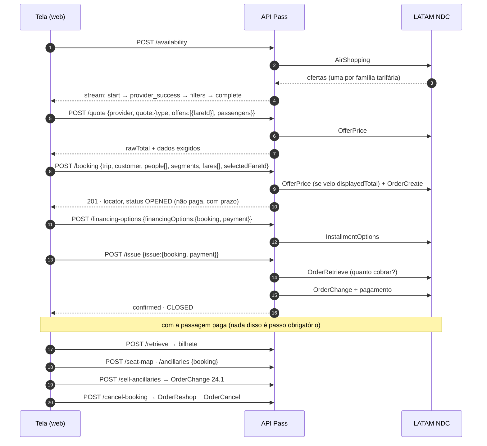

# Rotas da API — referência completa (LATAM NDC)

Este documento descreve **cada rota** da API como ela funciona hoje com a LATAM: o que recebe, o que
faz por dentro e em que ordem, qual mensagem NDC dispara, o que devolve, que erros podem voltar e o
que já foi verificado contra o sandbox real.

Para outros públicos:

- quem **não programa** → [`fluxo.md`](fluxo.md), o mesmo caminho explicado sem código;
- quem vai **apresentar** o projeto → [`apresentacao.md`](apresentacao.md);
- o **porquê** de cada descoberta sobre o NDC → [`README` da raiz](../../README.md).

> Os exemplos de JSON mostram a **forma real** das mensagens. Os **valores** (preços, horários, ids)
> são ilustrativos, exceto quando o texto diz que foram medidos no sandbox.

---

## Sumário

| # | Rota | Etapa | Mensagem LATAM | Escreve? | Sandbox |
|---|---|---|---|---|---|
| 0 | [`GET /health`](#get-health--o-serviço-está-de-pé) | diagnóstico | — | não | ✅ |
| 1 | [`POST /ping`](#post-ping--a-credencial-funciona) | diagnóstico | OAuth2 `client_credentials` | não | ✅ |
| 2 | [`POST /availability`](#post-availability--buscar-voos) | 1 · Buscar | `AirShopping` v19.2 | não | ✅ 424 tarifas |
| 3 | [`POST /quote`](#post-quote--confirmar-o-preço) | 3 · Revisar | `OfferPrice` v19.2 | não | ✅ |
| 4 | [`POST /seat-map`](#post-seat-map--mapa-de-assentos) | 3 · Revisar / pós-compra | `SeatAvailability` v19.2, pela reserva ou pela oferta | não | ✅ 279 assentos |
| 5 | [`POST /ancillaries`](#post-ancillaries--opcionais) | 3 · Revisar / pós-compra | `ServiceList` v19.2, pela reserva ou pela oferta | não | ✅ 5 bagagens |
| 6 | [`POST /booking`](#post-booking--reservar) | 4 · Passageiro | `OrderCreate` v19.2 | **sim** | ✅ |
| 7 | [`POST /retrieve`](#post-retrieve--consultar-a-reserva) | a qualquer momento | `OrderRetrieve` v19.2 | não | ✅ |
| 8 | [`POST /financing-options`](#post-financing-options--parcelas-do-cartão) | 5 · Pagar | `InstallmentOptions` | não | ✅ até 8x |
| 9 | [`POST /issue`](#post-issue--pagar-a-reserva) | 5 · Pagar | `OrderRetrieve` + `OrderChange` v19.2 | **sim, cobra** | ✅ `OPENED → CLOSED` |
| 12 | [`POST /sell-ancillaries`](#post-sell-ancillaries--comprar-assento-e-bagagem) | pós-compra | `OrderChange` **v24.1** | **sim, cobra** | ⚠️ sandbox recusa a cobrança |
| 13 | [`POST /mark-seats`](#post-mark-seats--marcar-assento) | pós-compra | `SeatAvailability` + `OrderChange` 24.1 | **sim, cobra** | ⚠️ idem |
| 14 | [`POST /cancel-booking`](#post-cancel-booking--cancelar) | pós-compra | `OrderReshop` + `OrderCancel` v19.2 | **sim** | ✅ void, R$ 1.023,18 |
| — | [Rotas que respondem 501](#rotas-que-respondem-501) | — | — | — | — |

Todas as rotas seguem o contrato da Pass (`docs-api/docs-api/`): nome, corpo, resposta e códigos. Onde
a API faz algo a mais, a extensão é **declarada** e aditiva — um campo a mais, nunca um formato
diferente. As que existem hoje:

| Onde | Extensão | Por quê |
|---|---|---|
| `/seat-map`, `/ancillaries` | `seatMap.fareId` / `ancillaries.fareId` — o catálogo da **oferta**, antes de reservar | na LATAM a escolha costuma acontecer antes do localizador existir |
| `/seat-map` | `key` em cada assento (a 13ª chave) | comprar assento e bagagem num `/sell-ancillaries` só: uma cobrança, não duas |
| `/quote` | `familyCode`, `family`, `requiredParameters` | a família confirmada e o que a reserva vai exigir |
| `/booking` | `committed`, `confirmed`, `currency`, `passengers` soltos no `data` | o contrato deixa o resto "solto no `data`, à sua escolha" |
| `/sell-ancillaries` | `items[].name` | o comprovante mostra o nome, não uma chave opaca |
| `/retrieve` | `people[].id` | o id que `fields.tickets[].passengerId` e as rotas de assento usam |

As antigas `/order-seat-map` e `/order-ancillaries` **foram removidas**: o mesmo catálogo sai do
`/seat-map` e do `/ancillaries` endereçados pela reserva, como o contrato define.

---

## O fluxo inteiro, numa figura



---

## Convenções que valem para todas as rotas

### O dialeto do pedido

O corpo das rotas segue o **contrato da Pass** (`docs-api/docs-api/`). Duas regras estruturais:

**1. A rota carrega um bloco com o nome da operação.** `quote`, `cancel`, `issue`, `sellAncillaries`,
`markSeats`, `removeSeats`, `seatMap`, `ancillaries`, `financingOptions`, `cancelEticket`,
`retrieveEticket`, `paymentOptions`, `fareRules`.

```jsonc
{ "cancel": { "booking": { "locator": "LA…" } } }   // cancelar
{ "issue":  { "booking": { "locator": "LA…" }, "payment": { … } } }  // pagar
```

🔴 Não é enfeite. Um `{ "booking": { "locator": … } }` solto serve para cancelar, emitir e consultar,
e um cliente que erra a rota manda um corpo que o servidor aceita sem reclamar. Com o bloco, o corpo
diz qual operação ele descreve.

**2. As exceções são as que o contrato define.** `/retrieve` recebe `booking` direto; `/booking` tem o
corpo na raiz (`trip`, `customer`, `people[]`, `segments`…).

### Endereço, método e formato

- Base local: `http://localhost:3010` (variável `PORT`). Swagger em `/docs`.
- Todas as rotas de voo são `POST` na raiz, sem prefixo de versão, com corpo `application/json` —
  exceto `DELETE /remove-seats` (que responde 501) e `GET /health`.
- `/availability` responde em `text/event-stream`. Todas as outras respondem JSON.

### O caminho de uma requisição dentro da API

```
CorrelationMiddleware   gera ou reaproveita o x-correlation-id
      ▼
CapabilityGuard         "algum provedor no ar faz esta operação?"  → senão 501, antes de validar o corpo
      ▼
ValidationPipe          valida o corpo pelo DTO                     → 400 SEARCH_VALIDATION_ERROR
      ▼
FlightController        escolhe o caso de uso
      ▼
caso de uso             regra do contrato; escolhe o provedor; checa `supports` do provedor → 501
      ▼
LatamProvider           traduz contrato ↔ NDC
      ▼
LatamCommands           monta o XML da mensagem
      ▼
LatamClient             token, headers X-latam-*, timeout, retry, parse, erro NDC → catálogo
      ▼
EnvelopeInterceptor     embrulha o sucesso   |   ContractExceptionFilter formata qualquer erro
```

O **guard vem antes da validação** de propósito: um `/remove-seats` com corpo vazio precisa responder
"este provedor não faz isso" (501), não "seu corpo está errado" (400).

### Quem escolhe o provedor

| Rota | Como o provedor é decidido |
|---|---|
| `/availability` | `options.provider[]` ou, sem ele, **todos** os de `PROVIDERS`, em paralelo |
| `/quote`, `/booking`, `/fare-rules`, e `/seat-map`/`/ancillaries` pela oferta | o campo `p` **dentro da chave opaca** — nunca um parâmetro à parte. O `provider` do corpo, quando vem, tem que bater |
| `/retrieve`, `/cancel-booking`, `/financing-options`, `/issue`, `/sell-ancillaries`, `/mark-seats`, e `/seat-map`/`/ancillaries` pela reserva | `options.provider`; sem ele, o **primeiro** de `PROVIDERS` |
| `/ping` | `options.provider`, obrigatório |

🔴 Nas rotas endereçadas por localizador, **mande `options.provider: "latam"`**. Sem ele vale o
primeiro da lista `PROVIDERS`; se alguém inverter a ordem no `.env`, um localizador da LATAM seria
consultado em outro provedor.

Para uma instância só com LATAM: `PROVIDERS=latam`.

### Envelope de sucesso

Todas as rotas **exceto `/availability` e `/retrieve`** respondem com exatamente três chaves no topo:

```json
{
  "success": true,
  "data": { "…": "o resultado da rota" },
  "meta": {
    "provider": "latam",
    "duration": 1843,
    "timestamp": "2026-09-11T14:02:11.120Z",
    "operation": "quote",
    "correlationId": "5b0c7f3e-…"
  }
}
```

As duas exceções são as do contrato: o `/availability` é stream, e o `/retrieve` tem envelope próprio
(`connector`, `booking`, `status: "found"`, `message`, `data` — sem `meta`), como o 08-retrieve.md §2
define.

🔴 **HTTP 200 em todas, 201 só no `/booking`.** O `@Post` do Nest responde 201 por padrão, e por isso
cada rota declara o seu.

`meta.duration` é o tempo da requisição inteira em milissegundos, que nessas rotas é praticamente o
tempo da LATAM. `meta.provider` é o provedor que **atendeu**, lido de `data.provider`.

### Corpo de erro

Qualquer falha — validação, regra, LATAM, timeout — sai neste formato:

```json
{
  "success": false,
  "error": { "code": "FARE_PRICE_CHANGED", "category": "conflict" },
  "message": "The fare price changed since it was quoted.",
  "correlationId": "5b0c7f3e-…",
  "provider": "latam",
  "providerError": {
    "provider": "latam",
    "operation": "OfferPrice",
    "providerCode": "409107014",
    "providerMessage": "…",
    "providerSeverity": null,
    "httpStatus": 409
  },
  "details": { "errors": { "campo": ["mensagem"] } },
  "metadata": { "operation": "quote" }
}
```

- `error.code` sai sempre do catálogo (`api/src/common/errors/error-codes.ts`), e `message` é o texto
  fixo desse código, em inglês. O texto da LATAM **nunca** vira `message`.
- `provider` e `providerError` só aparecem quando a falha veio da companhia. Antes de publicar, a API
  apaga padrões de segredo (`Bearer …`, `Basic …`, `api_key=…`) e corta a mensagem em 400 caracteres.
- `details` só aparece em erro de validação ou regra; `metadata` só quando há o que dizer.
- O XML cru da LATAM não entra no corpo. Ele fica no log, ligado pelo `correlationId`.

### Correlação

Mande `x-correlation-id` no pedido para usar o seu; sem ele a API gera um UUID. Ele volta no header
da resposta, em `meta.correlationId` ou `correlationId` do erro, e vai para a LATAM como
`X-latam-Track-Id`. É o fio que liga a tela, o log da API e o suporte da LATAM.

### A chave opaca de venda (`fareId`)

🔴 **A chave é da TARIFA, não do trecho.** Um voo tem várias famílias tarifárias (LIGHT, PLUS, TOP) e
**cada uma é uma venda diferente**. Por isso:

| Campo | O que é | Serve para |
|---|---|---|
| `departure[].identifier` | a journey da companhia (`JOURNEY_1`) | contexto, auditoria |
| `departure[].fares[].fareId` | a chave **opaca** de venda | `/quote`, `/booking`, `/seat-map`, `/ancillaries` |
| `departure[].fares[].rules.key` | a chave opaca da regra tarifária | `/fare-rules` |

Quem consome trata a chave como caixa-preta: copia e devolve igual, sem montar nem ler. Por dentro é
um JSON em base64url que carrega tudo que a LATAM exige para voltar à mesma oferta sem a API guardar
estado:

| Chave | Conteúdo | Por quê |
|---|---|---|
| `p` | `"latam"` | decide o provedor nas rotas seguintes |
| `r` | `OfferID` da LATAM | a oferta inteira (ida + volta) |
| `o` | `PaxJourneyID` | qual trecho da oferta esta tarifa cobre |
| `i` | `OfferItemID` (formato `SEI\|…`) | o `OfferPrice` e o `SeatAvailability` pedem o item, não só a oferta |
| `d` | `"outward"` ou `"return"` | direção |
| `x` | `["ADT_1", "CHD_1", …]` | a `PaxList` da busca, que o `OfferPrice` exige de volta |

Isso está documentado para quem mantém a API. **Não** é contrato: pode mudar sem aviso.

Os **opcionais** têm a sua própria chave opaca (`offers[].key`, `seats[].key`), que carrega o par
`OfferItemID` + `ServiceID` — a LATAM exige os dois para vender, e publicar os dois soltos vazaria
detalhe dela para dentro do vocabulário comum.

### Vocabulário compartilhado

Objetos que aparecem igual em várias rotas:

```jsonc
"origin": { "iata": "GRU", "city": null, "terminal": null,
            "coordinates": { "lat": null, "lng": null } },

"time": { "departure": "2026-10-20T08:15:00-03:00",   // hora LOCAL, com fuso
          "arrival":   "2026-10-20T11:10:00-04:00",
          "duration":  235 },                          // MINUTOS; 0 = não informada

"baggage": {                       // dois nós, cada um com o SEU included
  "hand": { "included": true,  "pieces": 1, "weight": 10, "unit": "KG", "description": null },
  "hold": { "included": false, "pieces": 0, "weight": 0,  "unit": null, "description": null,
            "type": "checked" }
},

"taxes": { "boarding": null, "service": null, "fuel": null, "baggage": null, "total": 112.4 }
```

🔴 Três armadilhas que esses formatos evitam:

- **`hand` ≠ `hold`.** Uma tarifa LIGHT inclui bagagem de mão e **não** inclui despacho. Um booleano
  único fazia a LIGHT parecer que levava mala.
- **`taxes.total` é o que a companhia disse.** A LATAM manda o total, não a discriminação. Espalhar
  esse número em `boarding` publicava como taxa de embarque algo que ela nunca separou.
- **`duration` em minutos, não ISO.** A companhia declara `PT3H55M`; a API converte. Deixar o ISO
  passar obrigava cada tela a escrever o próprio parser.

### Tudo que a API manda para a LATAM em toda chamada

- **Token OAuth2** (`client_credentials`) em `LATAM_TOKEN_ENDPOINT`, com Basic Auth **e** `x-api-key`.
  Fica em memória até `min(LATAM_TOKEN_TTL_MS, expires_in − 60 s)`. Chamadas simultâneas esperam o
  mesmo pedido de token, sem abrir um por busca.
- **Headers**: `Authorization: Bearer …`, `X-latam-client-name`, `X-latam-Application-Name`,
  `X-latam-api-key`, `X-latam-Track-Id`, `X-latam-Country`, `X-latam-Lang`, `x-latam-Api-Version`.
- **No corpo NDC**: `MessageDoc`, `Party/Sender/TravelAgency` (agência, IATA, agente) e `POS/Country`.
- Sem `LATAM_API_KEY`/`LATAM_API_SECRET`, a API responde `401 PROVIDER_AUTHENTICATION_FAILED`
  **antes de sair para a rede**, com a instrução em `providerError.providerMessage`.

### Timeout e retry por mensagem

Leitura pode repetir. Escrita não repete nunca, porque a primeira tentativa pode ter valido.

| Mensagem | Timeout de leitura | Retry |
|---|---|---|
| Token | 10 s | 1 |
| `AirShopping` | 60 s | 1 |
| `OfferPrice` | 45 s | 1 |
| `SeatAvailability`, `ServiceList` | 45 s | 1 |
| `OrderRetrieve`, `InstallmentOptions` | 30 s | 1 |
| `OrderReshop` | 45 s | 1 |
| `OrderCreate` | 90 s | **0** |
| `OrderChange` (pagamento) | 90 s | **0** |
| `OrderChange` 24.1 (opcionais) | 120 s | **0** |
| `OrderCancel` | 45 s | **0** |

Resposta `401`/`403` numa leitura derruba o token em cache, gera outro e repete **uma** vez. Numa
escrita, o erro sobe direto: repetir com token novo seria uma segunda reserva ou uma segunda cobrança.

Esgotadas as tentativas: `504 PROVIDER_TIMEOUT` se foi tempo, `502 PROVIDER_INTEGRATION_ERROR` se
foi outra falha de rede.

### Erro da LATAM → código do contrato

O código de erro da LATAM tem 9 dígitos, e os três primeiros são o status HTTP. A API usa isso como
regra geral e sobrepõe os casos em que o significado é mais específico
(`api/src/modules/providers/latam/error.map.ts`).

| A LATAM responde | Vira | HTTP |
|---|---|---|
| texto `already cancelled` / `not suitable for void` / `order is cancelled` | `BOOKING_ALREADY_CANCELLED` | 409 |
| `404122006`, `404122007` (não voamos essa rota nessa data) | `ROUTE_NOT_FOUND` | 404 |
| `409107014` (preço mudou) | `FARE_PRICE_CHANGED` | 409 |
| `400300005` (valor do opcional não bate) | `FARE_PRICE_CHANGED` | 409 |
| `409140008` | `FARE_UNAVAILABLE` | 409 |
| `409300032 Unsuccessful authorize` | `PAYMENT_DECLINED` | 409 |
| `400107002`, `933`, `409123018` (estado da ordem não permite) | `RESOURCE_CONFLICT` | 409 |
| família `400` | `SEARCH_VALIDATION_ERROR` | 400 |
| família `401`, `403` | `PROVIDER_AUTHENTICATION_FAILED` | 401 |
| família `404` | `ROUTE_NOT_FOUND` | 404 |
| família `409` | `RESOURCE_CONFLICT` | 409 |
| família `422` | `BUSINESS_RULE_VIOLATION` | 422 |
| família `429` | `RATE_LIMITED` | 429 |
| família `500`, `502` | `PROVIDER_INTEGRATION_ERROR` | 502 |
| família `503` | `PROVIDER_UNAVAILABLE` | 503 |
| família `504` | `PROVIDER_TIMEOUT` | 504 |
| qualquer outra coisa | `PROVIDER_INTEGRATION_ERROR` | 502 |

A LATAM costuma responder **HTTP 200 com `<Error>` dentro**. Por isso vale o `<Error><Code>` do XML,
não o status da conexão.

---

## `GET /health` — o serviço está de pé?

Liveness. Não chama provedor nenhum e não usa o envelope.

```json
{
  "status": "ok",
  "service": "pass-flight-api",
  "port": 3010,
  "providers": ["latam"],
  "credentials": { "latam": "configured" }
}
```

Para saber se a LATAM responde de verdade, use o `/ping`: este endpoint só diz se a **configuração**
está de pé.

---

## `POST /ping` — a credencial funciona?

| | |
|---|---|
| Mensagem LATAM | pedido de token OAuth2, sempre novo (ignora o cache) |
| Escreve? | não |
| Limite | 10 chamadas por minuto **por provedor**, contadas por instância |

**Para que serve.** Provar que Key/Secret da integração são aceitos, sem gastar uma busca.

**Pedido**

```json
{
  "options": { "provider": "latam" },
  "ping": {
    "environment": "sandbox",
    "credentials": { "apiKey": "qualquer-coisa" }
  }
}
```

- `options.provider` é obrigatório.
- `ping.environment`: `sandbox` ou `production`.
- `ping.credentials`: objeto livre com pelo menos uma chave. **Não é usado para autenticar**: o teste
  vale para a credencial do `.env`, e a resposta avisa isso em `verification.scope: "connection"`.

**O que a API faz**

1. Confere o limite de 10 por minuto. Estourou → `429 RATE_LIMITED`, sem chamar a LATAM.
2. Pede um token novo à LATAM.
3. Respondeu → `valid: true`. Recusou → `401 PROVIDER_AUTHENTICATION_FAILED`. Não existe `200` com
   `valid: false`.

**Resposta**

```json
{
  "success": true,
  "data": {
    "valid": true,
    "provider": "latam",
    "environment": "sandbox",
    "verification": { "method": "auth", "scope": "connection" }
  },
  "meta": { "provider": "latam", "operation": "ping", "…": "…" }
}
```

🔴 **Token aceito não prova acesso à busca.** O endpoint de token responde 200 para qualquer app
registrado no portal, mas o gateway NDC recusa com `403122004 Forbidden User` o app sem a API
liberada. O teste definitivo é um `/availability` que volta ofertas.

---

## `POST /availability` — buscar voos

| | |
|---|---|
| Etapa na tela | 1 · Buscar |
| Mensagem LATAM | `IATA_AirShoppingRQ` → `POST /ndc/v192/airshopping` |
| Escreve? | não |
| Timeout / retry | 60 s / 1 |
| Resposta | `text/event-stream` |
| Sandbox | ✅ GRU→SCL: 424 tarifas para cerca de 94 voos, 12 delas executiva |

**Pedido** — a viagem é descrita por **pontas**, não por lista de trechos:

```json
{
  "type": "roundtrip",
  "departure": { "iata": "GRU", "date": "2026-10-20" },
  "arrival":   { "iata": "SCL", "date": "2026-10-27" },
  "passengers": { "adults": 1, "children": 0, "infants": 0 },
  "options": { "provider": ["latam"], "class": "business", "refundable": false,
               "language": "pt-br", "country": "BR" }
}
```

Multidestino usa `segments[]`, a lista **completa**:

```json
{
  "type": "multicity",
  "segments": [
    { "origin": "GRU", "destination": "SCL", "date": "2026-10-15" },
    { "origin": "SCL", "destination": "LIM", "date": "2026-10-19" },
    { "origin": "LIM", "destination": "GRU", "date": "2026-10-25" }
  ],
  "passengers": { "adults": 1 }
}
```

| Campo | Regra |
|---|---|
| `type` | `oneway`, `roundtrip` ou `multicity`. **Explícito** — nunca inferido pelas datas |
| `departure.iata` / `.date` | obrigatórios em `oneway` e `roundtrip` |
| `arrival.iata` | obrigatório; `arrival.date` é a **volta**, obrigatória em `roundtrip` |
| `segments[]` | só em `multicity`, mínimo 2 |
| `passengers.adults` | inteiro ≥ 1 |
| `passengers.children`, `infants` | inteiros ≥ 0, opcionais |
| `options.provider` | lista de nomes; opcional |
| `options.class` | `economy`, `premium_economy`, `business`, `first`; opcional |
| `options.refundable` | `true` devolve só tarifa que a LATAM **afirma** ser reembolsável |

🔴 Em ida-e-volta o destino da ida é a origem da volta — por isso uma ponta só, e não duas pernas.
`type` explícito existe para ninguém adivinhar ida-e-volta a partir de duas datas.

A coerência entre `type` e o corpo é checada **antes do primeiro evento**: um `roundtrip` sem
`arrival.date` vira `fatal_error` com `SEARCH_VALIDATION_ERROR`, em vez de abrir o stream e morrer
depois de já ter dito "buscando".

**O que a API faz**

1. Resolve os provedores e valida a forma da viagem.
2. Emite `start` imediatamente.
3. Monta um `OriginDestCriteria` por trecho, na ordem do itinerário, e uma `Pax` por passageiro
   (`ADT_1`, `CHD_1`, `INF_1`…). **Não manda a cabine** para a LATAM (motivo abaixo).
4. Chama o `AirShopping`. Ele é síncrono: a resposta única já traz todas as ofertas.
5. Normaliza cada `<Offer>` numa oferta canônica `{ outbound, inbound }`.
6. Aplica `options.class` e `options.refundable` sobre o resultado normalizado.
7. Emite `provider_success`, ou `provider_error` se não sobrou nada.
8. Emite `filters` e `complete`, e fecha a conexão.

**O stream** — cada evento é uma linha `data: {json}` seguida de linha em branco:

| Evento | Quando | Encerra? |
|---|---|---|
| `start` | sempre, primeiro | não |
| `provider_success` | um por provedor que devolveu ofertas | não |
| `provider_error` | um por provedor sem ofertas ou com falha | não |
| `filters` | depois de todos os provedores | não |
| `complete` | último evento de uma busca que chegou ao fim | **sim** |
| `fatal_error` | a busca inteira não pôde nem começar | **sim** |

**Onde as ofertas ficam em `data`**, conforme o tipo de viagem:

| `type` | Preenchido | Forma |
|---|---|---|
| `oneway` | `departure[]` | `{ "departure": [Leg], "return": [], "groups": [] }` |
| `roundtrip` | `groups[]` | `{ "groups": [{ "id": 1, "price": {…}, "departure": [Leg], "return": [Leg], "fares": [Fare] }], "departure": [], "return": [] }` |
| `multicity` | `itineraries[]` | `{ "itineraries": [{ "legs": [[Leg], [Leg], [Leg]], "fares": [Fare] }] }` |

🔴 Em `multicity`, `legs` tem **um item por trecho pedido**, na ordem da viagem. Nenhum trecho é
cortado para caber em ida e volta: GRU→SCL→LIM→GRU devolve três. Uma oferta com trecho ilegível
é descartada inteira, porque a companhia não vende o pacote pela metade.

**Um `Leg`**:

```json
{
  "identifier": "JOURNEY_1",
  "company": { "code": "LA", "name": null },
  "origin": { "iata": "GRU", "city": null, "terminal": null, "coordinates": { "lat": null, "lng": null } },
  "destination": { "iata": "SCL", "city": null, "terminal": null, "coordinates": { "lat": null, "lng": null } },
  "time": { "departure": "2026-10-20T08:15:00-03:00", "arrival": "2026-10-20T11:10:00-04:00", "duration": 235 },
  "stops": 0,
  "flights": [
    {
      "origin": { "iata": "GRU", "city": null, "terminal": null, "coordinates": { "lat": null, "lng": null } },
      "destination": { "iata": "SCL", "city": null, "terminal": null, "coordinates": { "lat": null, "lng": null } },
      "time": { "departure": "2026-10-20T08:15:00-03:00", "arrival": "2026-10-20T11:10:00-04:00", "duration": 235 },
      "company": { "code": "LA", "name": null, "operating": "LA" },
      "number": "8070",
      "segment": 0,
      "connection": false,
      "equipment": { "code": "320", "name": null, "description": null },
      "cabin": "economy"
    }
  ],
  "fares": [
    {
      "fareId": "eyJwIjoibGF0YW0iLCJyIjoi…",
      "code": "LIGHT",
      "familyCode": "…",
      "family": "LIGHT",
      "fareCode": "…",
      "bookingCode": "…",
      "cabin": "economy",
      "seats": null,
      "price": {
        "adult": { "base": 700.0, "taxes": { "boarding": null, "service": null, "fuel": null, "baggage": null, "total": 112.4 }, "fees": 0, "total": 812.4, "currency": "BRL" },
        "child": null,
        "baby": null,
        "total": { "base": 700.0, "taxes": { "boarding": null, "service": null, "fuel": null, "baggage": null, "total": 112.4 }, "fees": 0, "total": 812.4, "currency": "BRL" },
        "perPassenger": 812.4,
        "net": null
      },
      "fees": [],
      "baggage": {
        "hand": { "included": true, "pieces": 1, "weight": 10, "unit": "KG", "description": null },
        "hold": { "included": false, "pieces": 0, "weight": 0, "unit": null, "description": null, "type": "checked" }
      },
      "rules": {
        "refundable": false, "changeable": true, "penalties": [],
        "refund": null, "change": null, "cancellation": null, "noShow": null,
        "endorsable": null, "transferable": null,
        "key": "eyJwIjoibGF0YW0i…"
      },
      "benefits": null
    }
  ],
  "fees": []
}
```

**Como cada campo sai do XML da LATAM**

| Campo | Origem no `AirShoppingRS` | Detalhe |
|---|---|---|
| `time.departure/arrival` | `Dep`/`Arrival` → `AircraftScheduledDateTime` + atributo `TimeZoneCode` | o fuso vem num atributo separado; sem juntá-lo, um voo das 23h em Lima cai em outro dia. `-03:00`/`-0300` vira offset, `America/Santiago` é resolvido para o offset da data. 🔴 O sandbox manda `TimeZoneCode="UTC"` com a hora **local** (medido: SCL→LIM dá 110 min entre os carimbos para `Duration` de 230). Nesse caso o carimbo sai **sem offset**, e a duração vem da `Duration` declarada |
| `time.duration` | `Duration` (ISO-8601) → minutos | a companhia tem precedência sobre a conta pelos carimbos |
| `company.operating` | `OperatingCarrierInfo`; sem ele, o próprio `MarketingCarrierInfo` | codeshare é informação do segmento |
| `cabin` | `CabinTypeCode` (Y/M, W/S, C/J, F) ou `CabinTypeName` | código desconhecido vira `null`, nunca um chute |
| `stops` | quantidade de segmentos − 1 | |
| `fares[].code`, `family` | `PriceClassList` (`Code`/`Name`) ou `FareRefText` | LIGHT, PLUS, TOP… |
| `fares[].price.adult/child/baby` | `FareDetail` por `PaxRefID` | tudo ou nada: sem o adulto, os três vêm `null` |
| `fares[].baggage.hold` | `BaggageAllowance` com `TypeCode=Checked`, peso em KG | `hand` sai do `CarryOn` |
| `fares[].rules.*` | `CancelRestrictions`/`ChangeRestrictions` → `AllowedModificationInd` | basta um passageiro sem permissão para a oferta inteira não ter |
| `benefits` | `null` | a LATAM não estrutura comodidade na busca |

**Regras que importam**

- 🔴 **Uma oferta por família tarifária.** O mesmo voo chega repetido, e cada `Leg` traz **uma**
  tarifa. A tela agrupa por voo; o que segue adiante é o `fareId` da família escolhida.
- 🔴 **A cabine é filtrada do nosso lado, não na LATAM.** Com `PreferredCabinType C` o `AirShopping`
  devolveu **0** ofertas na mesma busca em que, sem filtro, devolveu **424**, 12 de executiva.
- `refundable: null` significa "a LATAM não disse". Quem pede só reembolsável não recebe essas.
- **Sem voos não é erro**: vem `provider_error` com `data.error.code = "NO_FLIGHTS"` e **sem**
  `canonicalCode`. Para distinguir "sem voos" de "falhou", olhe `canonicalCode`, não `type`.
- Ida e volta sem a volta não aparece: a LATAM não vende meia viagem.
- `international` é sempre `false`. Não há tabela IATA → país, e a API não adivinha.

---

## `POST /quote` — confirmar o preço

| | |
|---|---|
| Etapa na tela | 3 · Revisar |
| Mensagem LATAM | `IATA_OfferPriceRQ` → `POST /ndc/v192/offerPrice` (camelCase — ver abaixo) |
| Escreve? | não |
| Timeout / retry | 45 s / 1 |
| Contrato | `docs-api/docs-api/05-quote.md` |

**Para que serve.** Entre a busca e a escolha passa tempo, e passagem muda de preço ou esgota. O
`/quote` pergunta de novo: "esta oferta ainda existe, e por quanto?"

**Pedido** — `provider` e `options` na raiz, o pedido dentro do bloco `quote`:

```json
{
  "provider": "latam",
  "options": {},
  "quote": {
    "type": "roundtrip",
    "offers": [
      {
        "journeyKey": "JOURNEY_1",
        "fareId": "eyJwIjoibGF0YW0iLCJyIjoi…",
        "fareCode": "Q00QP5ZI",
        "bookingClass": "Q",
        "familyCode": "RY",
        "flightNumbers": ["8000"]
      }
    ],
    "passengers": { "adults": 1, "children": 0, "infants": 0 },
    "options": { "currency": "BRL" }
  }
}
```

🔴 **Na LATAM quem decide a venda é a tarifa.** O contrato aceita `journeyKey`, `fareId` ou
`fare.fareId`; o `journeyKey` sozinho não abre a oferta e responde 400 nomeando `quote.offers.0.fareId`.
Os outros campos são contexto de auditoria e **não** substituem a chave.

🔴 **Sem `quote.passengers` é 400.** Não há default: `adults: 1` tarifaria uma venda de três adultos
pelo preço de um.

Em ida e volta, tanto faz mandar o `fareId` da ida ou o da volta: os dois apontam para o mesmo
`OfferID`. Ofertas de **provedores diferentes** no mesmo pedido → `400`.

**Resposta** — escalar, para a viagem inteira:

```json
{
  "success": true,
  "data": {
    "provider": "latam",
    "available": true,
    "currency": "BRL",
    "rawTotal": 1023.18,
    "base": 850.0,
    "taxes": 173.18,
    "exchange": null,
    "familyCode": "RY",
    "family": "PREMIUM ECONOMY FULL",
    "requiredParameters": [
      { "name": "firstName", "type": "string", "displayText": "Nome", "perPassenger": true, "optional": false, "options": [] }
    ]
  },
  "meta": { "provider": "latam", "operation": "quote", "…": "…" }
}
```

| Campo | Regra |
|---|---|
| `rawTotal` | o total **cru** da LATAM, sem margem |
| `taxes` | 🔴 **derivado**: `rawTotal − base`. O invariante `base + taxes == rawTotal` é do contrato, e taxa de serviço à parte não pode quebrá-lo |
| `exchange` | sempre `null`: a API não converte moeda |
| `familyCode`, `family`, `requiredParameters` | extensões declaradas |

O **cenário pós-reserva** (`quote.booking`) responde **501**: a LATAM só devolve o total de uma ordem,
e o invariante não fecha com metade dos números.

**Regras que importam**

- `/ndc/v192/offerprice` em minúsculas responde `404 Invalid url or Method Not Allowed`. O caminho
  certo tem `P` maiúsculo e não aparece no YAML publicado. Todos os caminhos podem ser trocados por
  variável de ambiente (`LATAM_PATH_*`) sem recompilar.
- Sem `OwnerCode` depois do `OfferRefID` → `cvc-complex-type.2.4.a`. Sem a `PaxList` de volta →
  `cvc-identity-constraint.4.3: Key 'PaxIDKeyRef4' not found`. É por isso que os PaxIDs viajam dentro
  da chave opaca.

**Erros esperados**

| Situação | Código | HTTP |
|---|---|---|
| sem bloco `quote`, sem `passengers`, sem identificador de tarifa | `SEARCH_VALIDATION_ERROR` | 400 |
| `fareId` corrompido, ou de provedores diferentes | `SEARCH_VALIDATION_ERROR` | 400 |
| cenário pós-reserva | `CAPABILITY_NOT_SUPPORTED` | 501 |
| preço mudou (`409107014`) | `FARE_PRICE_CHANGED` | 409 |
| tarifa esgotou (`409140008`) | `FARE_UNAVAILABLE` | 409 |
| LATAM não devolveu total | `PRICING_ERROR` | 502 |

---

## `POST /seat-map` — mapa de assentos

| | |
|---|---|
| Mensagem LATAM | `IATA_SeatAvailabilityRQ` → `POST /ndc/v192/seats/availability` |
| Escreve? | não |
| Contrato | `docs-api/docs-api/09-assentos.md` §1 |

**Pedido** — pela **reserva**, como o contrato define:

```json
{
  "options": { "provider": "latam", "currency": "BRL" },
  "seatMap": {
    "booking": { "locator": "LA9572806QCFT" },
    "segments": [{ "id": "SEG_1" }],
    "passengers": [{ "id": "ADT_1" }]
  }
}
```

`segments` e `passengers` são filtros; ausentes, o mapa vem inteiro. Pela reserva, a API busca os
`PaxID` na própria ordem (`OrderRetrieve`) e manda `CoreRequest/Order`.

**Extensão declarada — pela oferta, antes de reservar:**

```json
{ "options": { "provider": "latam" }, "seatMap": { "fareId": "eyJwIjoibGF0YW0iLCJyIjoi…" } }
```

Aqui vai `CoreRequest/Offer` e a resposta traz `locator: null`. Mande `booking` **ou** `fareId`; os dois,
ou nenhum, é 400.

🔴 **Dois catálogos, e só um compra.** As chaves do mapa da oferta (`SEI|…`) morrem na emissão; só as
do mapa da reserva (`SEAT_…`) servem para o `/sell-ancillaries`. Usar a errada faz a LATAM responder
`INVALID_OFFER_TYPES: Mixed type offers are not supported`.

**Resposta**

```json
{
  "success": true,
  "data": {
    "provider": "latam",
    "locator": "LA9572806QCFT",
    "currency": "BRL",
    "paymentRequired": null,
    "passengers": [
      { "id": "ADT_1", "firstName": "ANDY", "lastName": "PETERSON", "assignedSeats": null }
    ],
    "segments": [
      {
        "segmentId": "SEG_1",
        "origin": "GRU", "destination": "SCL",
        "departureDate": "2026-10-20",
        "number": "8070",
        "company": { "code": "LA", "name": null },
        "equipment": { "code": "320", "name": null },
        "cabins": [
          {
            "cabinClass": "Economy",
            "rows": [
              {
                "number": "12",
                "exitRow": false,
                "seats": [
                  {
                    "seat": "12A", "row": "12", "column": "A",
                    "status": "available", "available": true, "paid": true,
                    "price": { "total": 59.9, "currency": "BRL" },
                    "characteristics": ["window"],
                    "providerCharacteristics": ["W"],
                    "commercialName": null,
                    "accessible": null,
                    "recline": null,
                    "key": "eyJvIjoiU0VBVF8…"
                  }
                ]
              }
            ]
          }
        ]
      }
    ]
  }
}
```

Cada assento traz as **12 chaves do contrato** e mais `key`, a chave de venda (extensão). `recline` é
`"restricted"` ou `null`, como no contrato.

🔴 **`assignedSeats: null` ≠ `[]`.** `null` é "a companhia não informa quais assentos o passageiro já
tem"; `[]` é "ela informa, e não há nenhum".

**Regras que importam**

- A LATAM fala dois vocabulários de status no mesmo endpoint, conforme o header de versão: V1
  (`Available`/`Unavailable`/`WINDOWS`) e V2 (`F` livre, `O` ocupado, `W` janela). A API aceita os
  dois e publica o canônico (`available`/`occupied`/`blocked`/`unavailable`), com o código cru ao lado
  em `providerCharacteristics`. Não está na doc: foi medido chamando a mesma oferta com e sem o
  header, e explicava 279 assentos voltando todos como ocupados.
- A LATAM manda um `CabinCompartment` **por fileira**, e não um compartimento com várias fileiras.
- 🔴 Pela oferta, o `OfferID` é o **item** (`SEI|…`), não o UUID da oferta: com o UUID ela responde
  `911 Public flight offer not found in cache by id <uuid>`.
- **Nunca quebra:** mapa ilegível vira `segments: []` e a tela mostra "indisponível". Leitura degrada;
  mutação falha.

---

## `POST /ancillaries` — opcionais

| | |
|---|---|
| Mensagem LATAM | `IATA_ServiceListRQ` → `POST /ndc/v192/services/list` |
| Escreve? | não |
| Contrato | `docs-api/docs-api/10-ancillaries.md` §1 |

**Pedido** — pela reserva; `fareId` no lugar de `booking` é a mesma extensão do `/seat-map`:

```json
{
  "options": { "provider": "latam", "currency": "BRL" },
  "ancillaries": {
    "booking": { "locator": "LA9572806QCFT" },
    "type": "baggage",
    "passengers": ["ADT_1"],
    "segments": ["SEG_1"]
  }
}
```

🔴 **`type` é ESTRITO**: oferta que a companhia não classificou (`type: null`) sai quando o filtro vem.
Consultar sem `type` e filtrar no cliente vê mais ofertas. Já oferta sem `passengerId`/`segmentId`
vale para **todos** — `null` ali é "a viagem inteira", não "nenhum".

**Resposta**

```json
{
  "success": true,
  "data": {
    "provider": "latam",
    "locator": "LA9572806QCFT",
    "currency": "BRL",
    "passengers": [{ "id": "ADT_1", "firstName": "ANDY", "lastName": "PETERSON", "type": "adult" }],
    "segments": [
      { "segmentId": "SEG_1", "origin": "GRU", "destination": "SCL",
        "departureDate": "2026-10-20", "number": "8070", "company": { "code": "LA", "name": null } }
    ],
    "offers": [
      {
        "key": "eyJvIjoiQkFHX…",
        "type": "baggage",
        "code": "0C3",
        "name": "FIRST_ADDITIONAL_BAGGAGE",
        "description": "…",
        "price": { "total": 180.0, "currency": "BRL" },
        "passengerId": "ADT_1",
        "segmentId": "SEG_1",
        "baggage": { "pieces": 1, "weight": 23, "unit": "KG" }
      }
    ]
  }
}
```

- `passengers[].type` é o do contrato (`adult`/`child`/`infant`), não o PTC cru.
- `baggage` é `{pieces, weight, unit}`. 🔴 `pieces` é o **total** do degrau: "SEGUNDA BAGAGEM" é
  `pieces: 2`, e o preço é do conjunto — somar degraus cobra a mais.
- `currency`: a da primeira oferta com preço; senão a do catálogo; senão a pedida.

**Regras que importam**

- 🔴 **O tipo é DECLARADO, nunca inferido do nome.** O prefixo do `OfferItemID` (`BAG_`, `SEAT_`) é
  estrutural; o nome é texto comercial que muda de idioma e de campanha.
- O `ServiceList` devolve **também os assentos**. A API os remove daqui, porque o lugar deles é o
  `/seat-map`, com fileira e coluna.
- 🔴 Pela reserva, o `ServiceList` exige `Order/OrderItem/GrandTotalAmount` (a API manda `0`, como a
  amostra da LATAM). Sem ele: `911 The content of element 'Order' is not complete`.
- Lista vazia é resposta válida. Catálogo ilegível vira catálogo vazio, sem erro.

---

## `POST /booking` — reservar

| | |
|---|---|
| Mensagem LATAM | `IATA_OfferPriceRQ` (se veio `displayedTotal`) → `IATA_OrderCreateRQ` → `POST /ndc/v192/order/create` |
| Escreve? | **sim** — cria a ordem na LATAM |
| Timeout / retry | 90 s / **0** |
| HTTP de sucesso | **201** (a única rota que não devolve 200) |
| Contrato | `docs-api/docs-api/06-booking.md` |

**Para que serve.** Criar a reserva. 🔴 **Reservar não é pagar**: a ordem nasce `OPENED`, sem
pagamento e com prazo. Passado o prazo, a LATAM a libera sozinha.

**Pedido** — os trechos e a tarifa vêm **copiados da busca**:

```json
{
  "provider": "latam",
  "trip": "oneway",
  "customer": {
    "email": "andy@exemplo.com",
    "phone": { "country": "55", "area": "11", "number": "999990000", "type": "mobile" },
    "country": "BR"
  },
  "people": [
    {
      "identifier": "ADT_1",
      "main": true,
      "firstName": "ANDY",
      "lastName": "PETERSON",
      "ageGroup": "adult",
      "birthdate": "1990-04-21",
      "gender": "male",
      "document": { "type": "PASSPORT", "number": "AB123456", "issuingCountry": "BR", "expiryDate": "2030-01-01" }
    }
  ],
  "segments": {
    "departure": [ { "identifier": "JOURNEY_1", "origin": { "iata": "GRU" }, "time": { "departure": "2026-10-20T08:00:00-03:00" }, "…": "o trecho da busca, sem `fares`" } ],
    "return": []
  },
  "fares": [ { "fareId": "eyJwIjoibGF0YW0iLCJyIjoi…", "appliesTo": "all", "…": "a tarifa da busca" } ],
  "selectedFareId": "eyJwIjoibGF0YW0iLCJyIjoi…",
  "displayedTotal": 1023.18,
  "options": { "currency": "BRL", "language": "pt-br" }
}
```

| Campo | Regra |
|---|---|
| `trip` | `oneway` \| `roundtrip` \| `multicity` — define a validação cruzada abaixo |
| `customer.email` / `phone` | `phone` é `ContactPhone`. **Pelo menos um**; a LATAM recusa a ordem sem contato |
| `people[].identifier` | 🔴 **o PaxID com que a oferta foi tarifada** (`ADT_1`, `CHD_1`…). Chega à companhia como veio; fora da lista da oferta → 400 nomeando os esperados |
| `people[].ageGroup` ou `type` | `adult`/`senior` → `ADT`, `child` → `CHD`, `infant` → `INF` |
| `people[].birthdate` | `YYYY-MM-DD` (`birthDate` também é aceito). O contrato marca opcional; a LATAM exige, e a API recusa antes |
| `people[].infantInfo` | bebê de colo no adulto: vira viajante próprio com o próximo `INF_*` da oferta |
| `segments` / `itinerary.legs` | copiados da busca. A data do último trecho confere a idade |
| `fares[]` | 🔴 **posicional**: na raiz (pacote, `appliesTo: "all"`) **ou** dentro dos trechos, nunca nos dois |
| `selectedFareId` | tem que existir em `fares[]` — não casar é falha, nunca cai numa outra tarifa |
| `displayedTotal` | âncora do gate de re-tarifa. Ausente, reserva pelo preço atual |
| `options.customParameters` | extensão: parâmetros do nível da reserva exigidos no `/quote` |

**Validação cruzada (400)**: sem `segments.departure` e sem `itinerary.legs`; `multicity` sem legs;
`oneway` com volta; `roundtrip` sem volta; `fares[]` nos dois lugares.

🔴 **Gate de re-tarifa.** Com `displayedTotal`, a API reconfere o preço na LATAM (`OfferPrice`) antes
de criar a ordem. Preço **maior** → `409 FARE_PRICE_CHANGED` e nada é reservado. Preço menor reserva
normalmente; tarifa que sumiu volta `409 FARE_UNAVAILABLE`.

**Resposta (201)** — os quatro endereços no **topo** do `data`:

```json
{
  "success": true,
  "data": {
    "locator": "LA9572806QCFT",
    "status": "OPENED",
    "provider": "latam",
    "bookingToken": null,
    "orderIdentifier": "LA9572806QCFT",
    "committed": true,
    "confirmed": false,
    "currency": "BRL",
    "passengers": [{ "id": "ADT_1", "type": "ADT", "firstName": "ANDY", "lastName": "PETERSON" }]
  },
  "meta": { "provider": "latam", "operation": "createBooking", "…": "…" }
}
```

| Campo | Significado |
|---|---|
| `locator` | o código da reserva. `BookingRef/ID` quando a LATAM devolve; senão, o `OrderID` |
| `status` | o estado **na companhia** (`OPENED`, `CLOSED`…) |
| `bookingToken` | sempre `null`: a LATAM não endereça por token |
| `orderIdentifier` | o `OrderID` NDC |
| `committed` | a LATAM aceitou e a ordem existe. **Nunca `null`** |
| `confirmed` | só `true` em status final (`CLOSED`, `CONFIRMED`, `TICKETED`). **Nunca** deduzido de `committed` |

**Regras que importam**

- 🔴 **Guarde o `locator`.** É por ele que todas as rotas seguintes encontram a reserva.
- 🔴 **Não repita o `/booking` se a resposta se perder.** Consulte o `/retrieve`.
- `committed: true` com `confirmed: false` é o estado **normal** depois de reservar. Não é falha, e
  não autoriza reservar de novo.
- Contato ausente volta `912 ContactInfoList is null or empty`; tirar só a referência troca o erro por
  `cvc-identity-constraint.4.3`. A API recusa antes, com o campo nomeado.

---

## `POST /retrieve` — consultar a reserva

| | |
|---|---|
| Mensagem LATAM | `IATA_OrderRetrieveRQ` → `POST /ndc/v192/order/retrieve` |
| Escreve? | não |
| Cache | **nenhum** |
| Contrato | `docs-api/docs-api/08-retrieve.md` |

**Para que serve.** Saber o estado da reserva **agora**. É a leitura independente que confirma o
efeito de reservar, pagar e cancelar, e a saída sempre que uma escrita perdeu a resposta.

**Pedido**

```json
{
  "options": { "provider": "latam" },
  "booking": { "locator": "LA9572806QCFT", "lastName": "Peterson", "language": "pt-br" }
}
```

`booking` é tolerante: campos extras são ignorados. A LATAM só usa o `locator`.

**Resposta** — 🔴 **o único envelope próprio**, como o contrato define (sem `meta`):

```json
{
  "success": true,
  "connector": "latam",
  "booking": "LA9572806QCFT",
  "status": "found",
  "message": "Booking retrieved successfully",
  "data": {
    "status": "confirmed",
    "type": "flight",
    "trip": "oneway",
    "grouping": "segmented",
    "title": "GRU - SCL",
    "destination": { "iata": "SCL", "code": "SCL", "name": null, "city": null, "country": null, "coordinates": { "lat": null, "lng": null } },
    "iata": { "from": "GRU", "to": "SCL" },
    "departure": "2026-10-20T08:00:00",
    "arrival": "2026-10-20T11:55:00",
    "currency": "BRL",
    "createdAt": "2026-09-11T13:58:02",
    "expiresAt": "2026-09-12T04:00:00",
    "confirmationAt": "2026-09-11T13:58:02",
    "people": [
      {
        "id": "ADT_1", "main": true, "name": "ANDY PETERSON", "firstName": "ANDY", "lastName": "PETERSON",
        "email": null, "phone": { "country": null, "area": null, "number": null, "type": null },
        "nationality": null, "document": { "type": null, "number": "AB123456" },
        "birthdate": "1990-04-21", "age": 36, "type": "adult", "ageGroup": "adult",
        "gender": null, "loyalty": null
      }
    ],
    "segments": {
      "departure": [
        {
          "identifier": null, "provider": "latam", "company": { "code": "LA", "name": null },
          "origin": { "iata": "GRU", "…": "…" }, "destination": { "iata": "SCL", "…": "…" },
          "time": { "departure": "2026-10-20T08:00:00", "arrival": "2026-10-20T11:55:00", "duration": 235, "nextDay": false },
          "stops": 0,
          "flights": [
            { "number": "8070", "connection": false, "origin": { "iata": "GRU" }, "destination": { "iata": "SCL" },
              "company": { "code": "LA", "name": null },
              "time": { "departure": "2026-10-20T08:00:00", "arrival": "2026-10-20T11:55:00", "duration": 235 },
              "equipment": { "code": "320", "name": null, "description": null } }
          ]
        }
      ],
      "return": []
    },
    "itinerary": null,
    "fares": [
      { "fareId": null, "code": null, "appliesTo": "all", "name": null, "fareCode": "Q00QP5ZI", "bookingCode": "Q",
        "familyCode": null, "cabin": "economy", "refundable": null, "changeable": null, "baggage": null,
        "price": { "adult": null, "child": null, "baby": null, "total": 1023.18 } }
    ],
    "provider": { "code": "latam", "name": null, "locator": "LA9572806QCFT" },
    "supplier": { "confirmation": "NW6PFQ" },
    "fields": {
      "providerStatus": "CLOSED",
      "system": "LA",
      "issueDate": null,
      "balanceDue": null,
      "permissions": { "canIssue": false, "canCancel": true, "canRebook": null, "canSelectSeats": null, "canReissueCombined": null, "canReissueWithFare": null },
      "contacts": [{ "type": "passenger", "name": "ANDY PETERSON", "email": null, "phone": null }],
      "tickets": [{ "passengerId": "ADT_1", "ticketNumber": "045…", "status": "OK", "issueDate": null, "cancelToken": null }],
      "ancillaries": [],
      "pricing": { "currency": "BRL", "total": 1023.18, "breakdown": [] }
    }
  }
}
```

| Campo | Origem / regra |
|---|---|
| `data.status` | de **venda**: `confirmed`, `pending` ou `cancelled`, pela precedência abaixo |
| `fields.providerStatus` | o estado **fino**, com sinônimos normalizados (`OPENED`→`HOLD`, `ISSUED`→`TICKETED`); o que não reconhece passa cru |
| `trip` / `grouping` | 1 perna → `oneway`/`segmented`; 2 espelhadas → `roundtrip`/`provider-group`; o resto → `multicity` |
| `segments` / `itinerary` | 🔴 **mutuamente exclusivos**. Num `oneway`, `segments.return` é `[]` |
| `expiresAt` | o **menor** `PaymentTimeLimitDateTime` entre os `OrderItem`: o prazo para pagar |
| `fares` | uma tarifa de pacote na raiz, `appliesTo: "all"`. `null` quando a ordem não traz tarifa |
| `fields.tickets` | exatamente 5 campos. EMDs vão para `fields.ancillaries` |
| `fields.pricing.total` | `Order/TotalPrice/TotalAmount` — é o valor que o `/issue` cobra |

**Precedência do status**, nesta ordem:

1. **todos** os cupons do bilhete `VOID`/`V`/`REFUND`/`REFUNDED` → `cancelled`;
2. status da ordem `CLOSED`/`CONFIRMED`/`TICKETED` → `confirmed`;
3. `FAILED`/`REJECTED`/`CANCELLED` → `cancelled`;
4. qualquer outro (inclusive `OPENED`) → `pending`.

**Regras que importam**

- 🔴 **Bilhete anulado continua `CLOSED` na LATAM.** Quem diz a verdade é o cupom, e por isso ele
  vence o status da ordem.
- 🔴 **As pernas saem do `PaxJourneyList`**, não da contagem de segmentos. Uma ida com conexão tem
  dois segmentos e continua `oneway`.
- 🔴 **Reserva cancelada é 200** (o "caminho pobre": quase tudo `null`); localizador inexistente é 404.

---

## `POST /financing-options` — parcelas do cartão

| | |
|---|---|
| Mensagem LATAM | `InstallmentOptionsRQ` (**não é NDC**) → `POST /ndc/v192/installments/options` |
| Escreve? | não — só consulta |
| Contrato | `docs-api/docs-api/11-emissao.md` §2 |

**Pedido**

```json
{
  "options": { "provider": "latam", "currency": "BRL" },
  "financingOptions": {
    "booking": { "locator": "LA9572806QCFT" },
    "payment": { "creditCard": { "number": "4000000000002701" } }
  }
}
```

**Resposta**

```json
{
  "success": true,
  "data": {
    "provider": "latam",
    "locator": "LA9572806QCFT",
    "currency": "BRL",
    "source": "provider",
    "minInstallmentAmount": null,
    "plans": [
      {
        "installments": 8,
        "financingId": "TRX-…",
        "cardBrand": { "code": "VI", "name": null },
        "interestFree": true,
        "interest": { "monthlyPercent": null, "amount": { "currency": "BRL", "total": 0 } },
        "installmentAmount": { "currency": "BRL", "total": 127.9 },
        "firstInstallmentAmount": null,
        "totalAmount": { "currency": "BRL", "total": 1023.18 }
      }
    ]
  }
}
```

- `plans: []` é resposta válida: o valor pode estar abaixo da parcela mínima.
- Mande o `financingId` do plano escolhido como `creditCard.financingId` no `/issue`.
- 🔴 `interest.monthlyPercent` sai `null`: a LATAM informa uma taxa sem dizer de que período, e
  publicá-la como "mensal" seria um número errado. `interestFree` é o fato que dá para afirmar.
- 🔴 `firstInstallmentAmount` sai `null`: a LATAM não distingue a primeira parcela.
- 🔴 A resposta da LATAM **não é NDC**: `<InstallmentOptionsRS>` na raiz, sem `<Response>` dentro.
- O número do cartão não volta na resposta e não é guardado. Veja a
  [nota sobre log](#dado-de-cartão-o-que-é-garantido-e-o-que-ainda-não-é).

---

## `POST /issue` — pagar a reserva

| | |
|---|---|
| Mensagens LATAM | `OrderRetrieve` (quanto cobrar) → `IATA_OrderChangeRQ` com `PaymentFunctions` |
| Escreve? | **sim — cobra o cartão** |
| Timeout / retry | 90 s / **0** |
| Contrato | `docs-api/docs-api/11-emissao.md` §3 |

**Pedido**

```json
{
  "options": { "provider": "latam" },
  "issue": {
    "booking": { "locator": "LA9572806QCFT" },
    "acceptFareChange": false,
    "payment": {
      "paymentMethod": "credit-card",
      "billedAmount": 1023.18,
      "creditCard": {
        "brand": "VI",
        "holderName": "ANDY PETERSON",
        "number": "4000000000002701",
        "cvv": "737",
        "expiryDate": "03/2030",
        "installments": 8,
        "financingId": "TRX-…",
        "holderCpf": "52998224725",
        "holderBirthdate": "1990-04-21",
        "holderEmail": "andy@exemplo.com",
        "billingAddress": { "zipCode": "01310-100", "street": "Av. Paulista, 1000", "city": "São Paulo", "country": "BR" }
      }
    }
  }
}
```

| Campo | Regra |
|---|---|
| `creditCard.brand` | sigla ou código numérico, como o contrato aceita |
| `creditCard.expiryDate` | `MM/AAAA`. 🔴 A API converte para `MMAA`; um `replace('/')` ingênuo produzia seis dígitos onde a companhia espera quatro, e a recusa não dizia por quê |
| `creditCard.holderCpf` / `holderBirthdate` | **quem paga**, que pode não ser o passageiro. Sem eles a LATAM devolve `400113007 Payer is mandatory` — a API recusa antes, nomeando o campo |
| `creditCard.holderEmail` + `billingAddress` (`zipCode`, `street`, `country`) | vão como contato `BILLING` com endereço postal. Obrigatórios na LATAM |
| `creditCard.financingId` | o plano do `/financing-options`. Ausente, paga à vista |
| `billedAmount` | **opcional**. Se vier, é o valor que você **espera** pagar |

Cartão de teste do sandbox: `4000000000002701`, CVV `737`, validade `03/2030`.

**O que a API faz**

1. Confere se o provedor paga (senão, 501).
2. 🔴 **Pergunta o total à LATAM** com um `OrderRetrieve`. O valor cobrado é o dela, **nunca** o do corpo.
3. A LATAM não informou total → `502` (`providerCode: NO_TOTAL`), e **nada é cobrado**.
4. Veio `billedAmount` e difere em mais de R$ 0,01 → `409 FARE_PRICE_CHANGED`, e **nada é cobrado**.
5. Envia o `OrderChange` com `PaymentProcessingDetails`. **Sem retry.**
6. Lê os números de bilhete nos **dois** lugares em que a LATAM pode colocá-los.
7. Registra no log só `locator` e `correlationId`.

**Resposta**

```json
{
  "success": true,
  "data": {
    "provider": "latam",
    "locator": "LA9572806QCFT",
    "committed": true,
    "confirmed": true,
    "queued": false,
    "amount": { "currency": "BRL", "total": 1023.18 },
    "authorizationCode": "AUTH-…",
    "tickets": [
      { "ticketNumber": "045…", "type": "flight", "passengerId": "ADT_1", "passengerName": null,
        "status": "issued", "providerStatus": "OK", "issueDate": null, "cancelToken": null,
        "company": { "code": null, "name": null }, "amount": null, "message": null }
    ],
    "emds": [],
    "messages": [{ "code": null, "text": "…" }]
  }
}
```

🔴 **A prova de emissão é o NÚMERO DO BILHETE, não o status:**

| `confirmed` | Quando |
|---|---|
| `true` | há documento na mão |
| `false` | a ordem fechou e **nenhum** documento veio — procuramos a prova e ela não estava lá |
| `null` | a companhia ainda não fechou; a prova ainda não existe. Consulte o `/retrieve` |

- `tickets[]` e `emds[]` são listas **separadas**: documento de voo e de serviço têm ciclos de vida
  diferentes, e anular um não anula o outro.
- 🔴 Status de documento fora do mapa vira `unknown`, **nunca** `issued`.

**Erros esperados**

| Situação | Código | HTTP | Cobrou? |
|---|---|---|---|
| corpo inválido (cartão, validade, CPF, endereço ausente) | `SEARCH_VALIDATION_ERROR` | 400 | não |
| `billedAmount` diferente do total | `FARE_PRICE_CHANGED` | 409 | não |
| a LATAM não informou o total | `PROVIDER_INTEGRATION_ERROR` | 502 | não |
| operadora recusou (`409300032`) | `PAYMENT_DECLINED` | 409 | não |
| ordem em estado que não aceita pagamento | `RESOURCE_CONFLICT` | 409 | não |
| timeout | `PROVIDER_TIMEOUT` | 504 | **não se sabe** → `/retrieve` |

---

## `POST /sell-ancillaries` — comprar assento e bagagem

| | |
|---|---|
| Mensagens LATAM | `OrderRetrieve` ×2 + `SeatAvailability` + `ServiceList` (em paralelo) → `IATA_OrderChangeRQ` **24.1** |
| Escreve? | **sim — cobra o cartão** |
| Timeout / retry | 120 s / **0** na compra |
| Sandbox | ⚠️ pedido aceito em toda a validação; o sandbox **não autoriza** a cobrança |
| Contrato | `docs-api/docs-api/10-ancillaries.md` §3 |

**Pedido**

```json
{
  "options": { "provider": "latam" },
  "sellAncillaries": {
    "booking": { "locator": "LA9572806QCFT" },
    "items": [
      { "key": "eyJvIjoiU0VBVF8…", "passengerId": "ADT_1", "segmentId": "SEG_1", "type": "seat", "row": "12", "column": "C" },
      { "key": "eyJvIjoiQkFHX…", "passengerId": "ADT_1", "type": "baggage", "count": 1 }
    ],
    "payment": { "creditCard": { "…": "o mesmo cartão do /issue" } }
  }
}
```

| Campo | Regra |
|---|---|
| `items[].key` | **tem que vir do `/seat-map` ou do `/ancillaries` desta reserva** (endereçados por `booking`) |
| `items[].row` / `column` | obrigatórios para assento — extensão: a LATAM quer a poltrona além do id |
| `payment.creditCard` | a LATAM cobra na hora: soma maior que zero sem cartão → **422** |

**Não existe campo de valor: a API calcula.**

**O que a API faz**

1. Lê **os dois catálogos da reserva em paralelo** e monta um índice `key → preço`. Assento sem preço
   conta como cortesia, valor zero.
2. Alguma `key` fora do catálogo → `400` listando as chaves, **antes** de chamar a compra.
3. Soma o total **a partir do catálogo**.
4. Total > 0 sem cartão → `422 BUSINESS_RULE_VIOLATION`. Total = 0 → paga por BSP
   (`SettlementPlan/PaymentTypeCode: CA`).
5. Monta o `OrderChange` 24.1 no envelope EASD (dois namespaces, `easd:` nos filhos do topo), nesta
   ordem: `easd:AugmentationPoint` com o CPF do titular, `easd:DistributionChain`,
   `easd:PayloadAttributes` (`24.1`) e `easd:Request`. **Sem retry.**
6. Cruza o que foi **pedido** com o que a companhia devolveu. Nenhum item aceito → erro, não 200 —
   **exceto** quando a companhia já gravou (`committed: true`): aí o cartão pode ter sido cobrado, e um
   erro levaria quem chama a repetir e pagar duas vezes. Nesse caso é 200 com os itens `failed`, e a
   verdade sai do `/retrieve`.

**Resposta**

```json
{
  "success": true,
  "data": {
    "provider": "latam",
    "locator": "LA9572806QCFT",
    "committed": true,
    "confirmed": true,
    "amount": { "currency": "BRL", "total": 239.9 },
    "items": [
      { "key": "eyJvIjoiU0VBVF8…", "passengerId": "ADT_1", "segmentId": "SEG_1", "type": "seat",
        "status": "issued", "price": { "currency": "BRL", "total": 59.9 },
        "documentNumber": "045…", "message": null, "name": "Assento 12C" }
    ]
  }
}
```

🔴 A resposta é montada a partir do que foi **pedido**, cruzada com o que a companhia devolveu. Item
que não voltou sai com `status: failed`. `status` é `booked` (pendurado, sem documento), `issued`
(documento nesta chamada) ou `failed`.

**Regras que importam**

- 🔴 **Dois catálogos, e só um compra.**

  | Pergunta feita por | Pedido | Id por dentro | Serve para |
  |---|---|---|---|
  | oferta, antes de reservar | `/seat-map`, `/ancillaries` com `fareId` | `SEI\|…` | olhar; morre na emissão |
  | reserva, depois de pagar | `/seat-map`, `/ancillaries` com `booking` | `SEAT_…`, `BAG_…` | **comprar** |

  Usar o primeiro faz a LATAM responder `INVALID_OFFER_TYPES: Mixed type offers are not supported`. E
  o prefixo é o que roteia o pedido: um id em outro formato cai no fluxo de **troca de voo**.
- 🔴 **O CPF vai na raiz da mensagem**, como `easd:AugmentationPoint`, com `IdentityDocTypeCode: I`
  (e não `CPF`, como diz a doc). Cinco posições testadas até achar.
- 🔴 **A chave carrega dois ids.** Sem `SelectedBundleServices/SelectedServiceRefID` a companhia
  recusa com `400112165`, e o `ServiceID` não aparece no mapa de assentos — só no `ALaCarteOfferItem`.
- **Onde parou no sandbox.** Com valor errado de propósito, a LATAM responde `400300005 Payment amount
  does not match order total`: leu, entendeu e conferiu. Com o valor certo, responde
  `409300032 Unsuccessful authorize`. Por BSP, idem. O pedido está correto; o ambiente de testes não
  autoriza cobrança de opcional.
- ⚠️ **Ainda não implementado:** a rede de idempotência do 10-ancillaries.md §3.4 (ler o que já está
  pendurado antes de vender). Hoje a proteção é não ter retry.

---

## `POST /mark-seats` — marcar assento

| | |
|---|---|
| Mensagens LATAM | `OrderRetrieve` + `SeatAvailability` (pela ordem) → `OrderChange` 24.1 |
| Escreve? | **sim — cobra o cartão** |
| Contrato | `docs-api/docs-api/09-assentos.md` §2 |

**Pedido** — o assento é endereçado pelo **designador**, não pela chave do catálogo:

```json
{
  "options": { "provider": "latam" },
  "markSeats": {
    "booking": { "locator": "LA9572806QCFT" },
    "seats": [
      { "passengerId": "ADT_1", "segmentId": "SEG_1", "seat": "12A" }
    ],
    "payment": { "method": "credit-card", "creditCard": { "…": "…" } },
    "options": { "waiveRestrictedSeat": false, "waiveSeatFee": false }
  }
}
```

🔴 **A tradução acontece do lado de cá.** O contrato endereça pelo designador (`12A`) — o que a pessoa
escolheu na tela — e a companhia vende por `OfferItemID`. A API relê o mapa da própria reserva e faz
a ponte.

🔴 **Recusado ANTES da rede, com 422 `BUSINESS_RULE_VIOLATION`:** designador malformado (`"A12"`),
passageiro que a reserva não tem, assento fora do mapa ou já tomado. Melhor não oferecer do que
oferecer e falhar depois.

Na LATAM **marcar e comprar assento são a mesma operação**: o assento é confirmado no mesmo pedido em
que é cobrado, e sem cartão (soma maior que zero) é 422.

**Resposta** — um item em `seats[]` por assento **pedido**; `meta.operation` é `assignSeats`:

```json
{
  "success": true,
  "data": {
    "provider": "latam",
    "locator": "LA9572806QCFT",
    "committed": true,
    "confirmed": true,
    "amount": { "currency": "BRL", "total": 59.9 },
    "seats": [
      { "passengerId": "ADT_1", "segmentId": "SEG_1", "seat": "12A",
        "status": "assigned", "price": { "currency": "BRL", "total": 59.9 }, "message": null }
    ]
  },
  "meta": { "provider": "latam", "operation": "assignSeats", "…": "…" }
}
```

🔴 O `segmentId` da resposta é o do **pedido**: é a chave que quem consome tem na tela.

---

## `POST /cancel-booking` — cancelar

| | |
|---|---|
| Mensagens LATAM | `IATA_OrderReshopRQ` → `IATA_OrderCancelRQ` |
| Escreve? | **sim** |
| Timeout / retry | reshop 45 s / 1 · cancel 45 s / **0** |
| Sandbox | ✅ `VOID completed successfully`, cupom `V`, R$ 1.023,18 declarados como devolvidos |

**Pedido**

```json
{
  "options": { "provider": "latam" },
  "cancel": {
    "booking": { "locator": "LA9572806QCFT" },
    "options": {
      "reason": "Cliente solicitou cancelamento",
      "refundType": "Refund",
      "notifyContacts": "None",
      "comments": ["Cancelamento solicitado pelo cliente final."]
    }
  }
}
```

**Resposta** — 🔴 **plana agora**; o `data.data` foi removido:

```json
{
  "success": true,
  "data": {
    "locator": "LA9572806QCFT",
    "status": "CANCELLED",
    "outcome": "VOID",
    "provider": "latam",
    "cancelledAt": "2026-09-11T14:04:00.000Z",
    "message": null,
    "eticketsCancelled": true,
    "refund": { "amount": 1023.18, "currency": "BRL", "status": "REQUESTED" },
    "tickets": [],
    "providerStatus": "VOID COMPLETED SUCCESSFULLY"
  }
}
```

| Campo | Significado |
|---|---|
| `status` | `CANCELLED` ou `PENDING`. Recusa de verdade vira erro HTTP, não status |
| `outcome` | 🔴 **o EFEITO, que não é o status.** `VOID` anula o bilhete e não devolve dinheiro; `REFUND` devolve. Quem atende o passageiro precisa dos dois |
| `eticketsCancelled` | `false` até o **cupom** provar o contrário — o RS de sucesso não diz nada sobre documento |
| `refund.status` | `REQUESTED`: pedido aceito, **não** liquidação financeira |
| `refund.amount` | `amount`, não `total`: é o vocabulário do modelo nesta rota |

**Duas formas de cancelar**

| O reshop responde | Situação | O que a API manda |
|---|---|---|
| `Desc/DescText: VOID permitted` | dentro da janela de arrependimento | `OrderCancel` só com o `OrderID` |
| `PriceDifferential` com `DifferentialTypeCode: Refund` | fora dela | `OrderCancel` com `ExpectedRefundAmount` |

**Regras que importam**

- 🔴 **O `OrderReshop` não é opcional.** O `OrderCancel` exige `ExpectedRefundAmount`, e o valor sai
  dele. Nem valor nem void → `502` (`NO_REFUND_QUOTE`), **sem tentar cancelar**: mandar zero
  significaria abrir mão do reembolso.
- 🔴 **Antes de pagar não há o que cancelar.** A ordem `OPENED` expira sozinha, e a LATAM recusa com
  `400107002 Invalid order current status` → `409`.
- 🔴 **O mesmo código significa duas coisas opostas.** `400107002` é "ainda não paga" **e** "já
  cancelada". A API desempata lendo o cupom e responde `BOOKING_ALREADY_CANCELLED` no segundo caso.
- 🔴 **Depois do void, a ordem continua `CLOSED`.** O `/retrieve` publica `cancelled` porque lê o cupom.
- 🔴 **O void não devolve `StatusCode`**: confirma em texto, num `MarketingMessage`. A leitura é
  estrita — só `completed`/`success` contam; qualquer outro texto vira `PENDING`, e pendente manda
  consultar em vez de afirmar o que não foi dito.

---

## Rotas que respondem 501

Existem no contrato; não são atendidas **nesta API**. Respondem `501 CAPABILITY_NOT_SUPPORTED` no
corpo de erro padrão, e nunca um formato alternativo ou XML cru.

⚠️ A distinção que mais importa: **"a companhia não faz" é diferente de "ainda não integramos".**

| Rota | Por quê | De quem é a dívida |
|---|---|---|
| `POST /fare-rules` | a NDC devolve penalidade **estruturada** (já publicada em `fares[].rules`), e não o texto integral da tarifa que a rota exige. Inventar uma seção a partir disso seria publicar como condição algo que não é | da companhia |
| `DELETE /remove-seats` | existe na NDC (`OrderChange` com oferta `SEAT_`); não ligado a esta rota. O método recomendado é `POST`; `DELETE` com corpo é compatibilidade deprecated | **nossa** |
| `POST /payment-options` | rota da plataforma, que lista formas de pagamento de consolidadores. A LATAM não é exposta aqui; para parcelas, use `/financing-options` | não se aplica |
| `POST /retrieve-eticket` | existe na NDC; não integrado. Enquanto isso o `/retrieve` já devolve os documentos em `fields.tickets` | **nossa** |
| `POST /cancel-eticket` | existe na NDC; não integrado. Não confundir com `/cancel-booking`: void anula o bilhete, cancelar a order pode envolver reembolso | **nossa** |

Com `PROVIDERS=latam`, o 501 sai do **guard**, antes de validar o corpo.

---

## Dado de cartão: o que é garantido e o que ainda não é

Passa por `/financing-options` (número), `/issue`, `/sell-ancillaries` e `/mark-seats` (número, CVV,
validade).

**Garantido pelo código hoje**

- não é gravado em banco, arquivo ou cache: a API não tem persistência;
- não volta em resposta nenhuma;
- os logs explícitos dessas rotas registram só `operation`, `locator` e `correlationId`;
- o corpo de erro nunca carrega o XML enviado.

**⚠️ Risco em aberto — log de falha de rede.** Quando a chamada à LATAM falha **sem resposta**
(timeout, conexão recusada), o `LatamClient` registra o objeto de erro do axios inteiro
(`logger.error({ …, err })`). O logger do Nest imprime esse objeto com `util.inspect`, e o erro do
axios carrega o `config` da requisição, **inclusive o corpo XML**, que no `/issue` e no
`/sell-ancillaries` contém número, CVV e validade do cartão. Isso não foi reproduzido em execução, mas
é o comportamento das duas bibliotecas nas versões instaladas. **Corrigir antes de qualquer uso real:**
logar só `code`/`message` do erro, ou redigir `config.data`.

Mesmo corrigido o log, os dados do cartão passam pela API. Em produção isso coloca a API no escopo
PCI-DSS, ou exige tokenização do cartão antes de chegar aqui.

---

## O que ainda não reflete este documento

| Onde | O que falta |
|---|---|
| `international` | sempre `false` — não há tabela IATA → país, e a API não adivinha |

O **Swagger** (`/docs`) está alinhado: os schemas saem dos DTOs e as descrições foram reescritas para
a LATAM.
