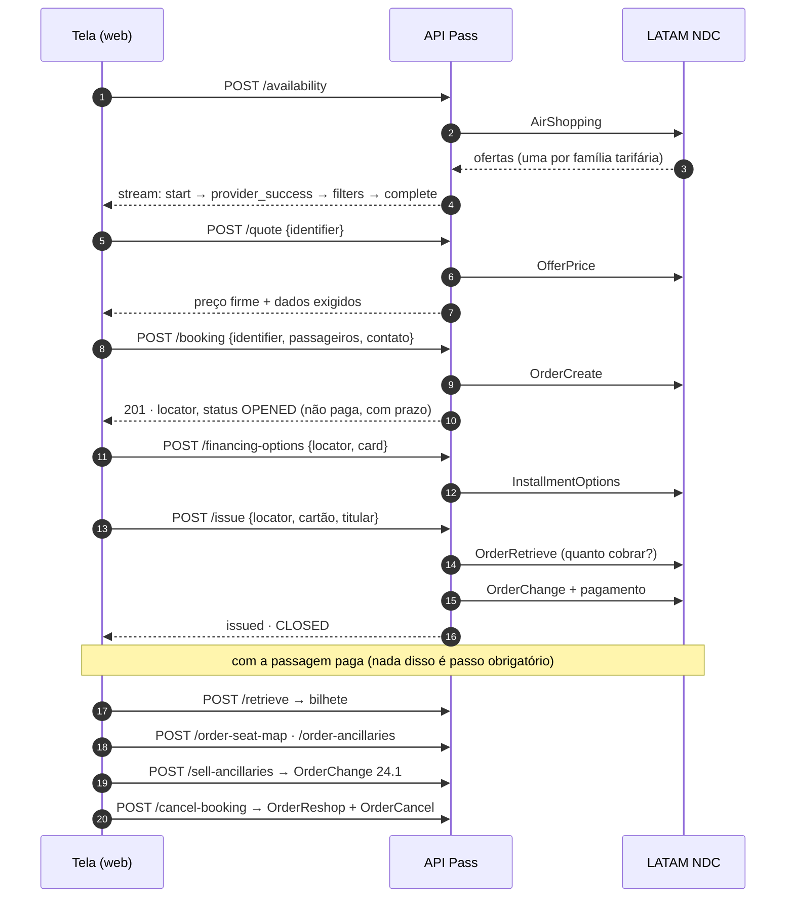

# Rotas da API — referência completa (LATAM NDC)

Este documento descreve **cada rota** da API como ela funciona hoje com a LATAM: o que recebe, o que
faz por dentro e em que ordem, qual mensagem NDC dispara, o que devolve, que erros podem voltar e o que
já foi verificado contra o sandbox real.

Para outros públicos:

- quem **não programa** → [`fluxo.md`](fluxo.md), o mesmo caminho explicado sem código;
- quem vai **apresentar** o projeto → [`apresentacao.md`](apresentacao.md);
- o **porquê** de cada descoberta sobre o NDC → [`README` da raiz](../../README.md#o-que-a-doc-da-latam-não-conta).

> Os exemplos de JSON mostram a **forma real** das respostas. Os **valores** (preços, horários, ids)
> são ilustrativos, exceto quando o texto diz que foram medidos no sandbox.

---

## Sumário

| # | Rota | Etapa | Mensagem LATAM | Escreve? | Sandbox |
|---|---|---|---|---|---|
| 0 | [`GET /health`](#get-health--o-serviço-está-de-pé) | diagnóstico | — | não | ✅ |
| 1 | [`POST /ping`](#post-ping--a-credencial-funciona) | diagnóstico | OAuth2 `client_credentials` | não | ✅ |
| 2 | [`POST /availability`](#post-availability--buscar-voos) | 1 · Buscar | `AirShopping` v19.2 | não | ✅ 424 tarifas |
| 3 | [`POST /quote`](#post-quote--confirmar-o-preço) | 3 · Revisar | `OfferPrice` v19.2 | não | ✅ |
| 4 | [`POST /seat-map`](#post-seat-map--assentos-da-oferta-vitrine) | 3 · Revisar | `SeatAvailability` v19.2, pela oferta | não | ✅ |
| 5 | [`POST /ancillaries`](#post-ancillaries--opcionais-da-oferta-vitrine) | 3 · Revisar | `ServiceList` v19.2, pela oferta | não | ✅ |
| 6 | [`POST /booking`](#post-booking--reservar) | 4 · Passageiro | `OrderCreate` v19.2 | **sim** | ✅ |
| 7 | [`POST /retrieve`](#post-retrieve--consultar-a-reserva) | a qualquer momento | `OrderRetrieve` v19.2 | não | ✅ |
| 8 | [`POST /financing-options`](#post-financing-options--parcelas-do-cartão) | 5 · Pagar | `InstallmentOptions` | não | ✅ até 8x |
| 9 | [`POST /issue`](#post-issue--pagar-a-reserva) | 5 · Pagar | `OrderRetrieve` + `OrderChange` v19.2 | **sim, cobra** | ✅ `OPENED → CLOSED` |
| 10 | [`POST /order-seat-map`](#post-order-seat-map--assentos-da-reserva-loja) | pós-compra | `OrderRetrieve` + `SeatAvailability`, pela ordem | não | ✅ 279 assentos |
| 11 | [`POST /order-ancillaries`](#post-order-ancillaries--opcionais-da-reserva-loja) | pós-compra | `OrderRetrieve` + `ServiceList`, pela ordem | não | ✅ 5 bagagens |
| 12 | [`POST /sell-ancillaries`](#post-sell-ancillaries--comprar-assento-e-bagagem) | pós-compra | `OrderChange` **v24.1** | **sim, cobra** | ⚠️ sandbox recusa a cobrança |
| 13 | [`POST /mark-seats`](#post-mark-seats--marcar-assento) | pós-compra | igual ao `/sell-ancillaries` | **sim, cobra** | ⚠️ idem |
| 14 | [`POST /cancel-booking`](#post-cancel-booking--cancelar) | pós-compra | `OrderReshop` + `OrderCancel` v19.2 | **sim** | ✅ void, R$ 1.023,18 |
| — | [Rotas que respondem 501](#rotas-que-respondem-501) | — | — | — | — |

As rotas 10 e 11 não existem no contrato canônico de 17 rotas (`docs-api/`). Foram acrescentadas
porque a LATAM tem **dois catálogos** de assento e bagagem, e a compra pós-emissão só aceita o segundo
(ver [`/sell-ancillaries`](#post-sell-ancillaries--comprar-assento-e-bagagem)).

---

## O fluxo inteiro, numa figura



---

## Convenções que valem para todas as rotas

### Endereço, método e formato

- Base local: `http://localhost:3010` (variável `PORT`). Swagger em `/docs`.
- Todas as rotas de voo são `POST` na raiz, sem prefixo de versão, com corpo `application/json` —
  exceto `DELETE /remove-seats` (que responde 501) e `GET /health`.
- `/availability` responde em `text/event-stream`. Todas as outras respondem JSON.

### O caminho de uma requisição dentro da API

```
CorrelationMiddleware   gera ou reaproveita o x-correlation-id
      ▼
CapabilityGuard         "algum provedor no ar faz esta operação?"  → senão 501, antes de validar o corpo
      ▼
ValidationPipe          valida o corpo pelo DTO                     → 400 SEARCH_VALIDATION_ERROR
      ▼
FlightController        escolhe o caso de uso
      ▼
caso de uso             regra do contrato; escolhe o provedor; checa `supports` do provedor → 501
      ▼
LatamProvider           traduz contrato ↔ NDC
      ▼
LatamCommands           monta o XML da mensagem
      ▼
LatamClient             token, headers X-latam-*, timeout, retry, parse, erro NDC → catálogo
      ▼
EnvelopeInterceptor     embrulha o sucesso   |   ContractExceptionFilter formata qualquer erro
```

O **guard vem antes da validação** de propósito: um `/remove-seats` com corpo vazio precisa responder
"este provedor não faz isso" (501), não "seu corpo está errado" (400).

### Quem escolhe o provedor

| Rota | Como o provedor é decidido |
|---|---|
| `/availability` | `options.provider[]` ou, sem ele, **todos** os de `PROVIDERS`, em paralelo |
| `/quote`, `/booking`, `/seat-map`, `/ancillaries`, `/fare-rules` | o campo `p` **dentro do `identifier`** — nunca um parâmetro à parte |
| `/retrieve`, `/cancel-booking`, `/financing-options`, `/issue`, `/order-*`, `/sell-ancillaries`, `/mark-seats` | `options.provider`; sem ele, o **primeiro** de `PROVIDERS` |
| `/ping` | `options.provider`, obrigatório |

🔴 Nas rotas endereçadas por localizador, **mande `options.provider: "latam"`**. Sem ele vale o
primeiro da lista `PROVIDERS`; se alguém inverter a ordem no `.env`, um localizador da LATAM seria
consultado em outro provedor.

Para uma instância só com LATAM: `PROVIDERS=latam`.

### Envelope de sucesso

Todas as rotas, exceto `/availability` e `/retrieve`, respondem com exatamente três chaves no topo:

```json
{
  "success": true,
  "data": { "...": "o resultado da rota" },
  "meta": {
    "provider": "latam",
    "duration": 1843,
    "timestamp": "2026-09-11T14:02:11.120Z",
    "operation": "quote",
    "correlationId": "5b0c7f3e-…"
  }
}
```

`meta.duration` é o tempo da requisição inteira em milissegundos, que nessas rotas é praticamente o
tempo da LATAM. `meta.provider` é o provedor que **atendeu**, lido de `data.provider`.

### Corpo de erro

Qualquer falha — validação, regra, LATAM, timeout — sai neste formato:

```json
{
  "success": false,
  "error": { "code": "FARE_PRICE_CHANGED", "category": "conflict" },
  "message": "The fare price changed since it was quoted.",
  "correlationId": "5b0c7f3e-…",
  "provider": "latam",
  "providerError": {
    "provider": "latam",
    "operation": "OfferPrice",
    "providerCode": "409107014",
    "providerMessage": "…",
    "providerSeverity": null,
    "httpStatus": 409
  },
  "details": { "errors": { "campo": ["mensagem"] } },
  "metadata": { "operation": "quote" }
}
```

- `error.code` sai sempre do catálogo de 18 códigos (`api/src/common/errors/error-codes.ts`), e
  `message` é o texto fixo desse código, em inglês. O texto da LATAM **nunca** vira `message`.
- `provider` e `providerError` só aparecem quando a falha veio da companhia. Antes de publicar, a API
  apaga padrões de segredo (`Bearer …`, `Basic …`, `api_key=…`) e corta a mensagem em 400 caracteres.
- `details` só aparece em erro de validação ou regra; `metadata` só quando há o que dizer.
- O XML cru da LATAM não entra no corpo. Ele fica no log, ligado pelo `correlationId`.

### Correlação

Mande `x-correlation-id` no pedido para usar o seu; sem ele a API gera um UUID. Ele volta no header
da resposta, em `meta.correlationId` ou `correlationId` do erro, e vai para a LATAM como
`X-latam-Track-Id`. É o fio que liga a tela, o log da API e o suporte da LATAM.

### Validação do corpo

- Campo obrigatório ausente ou com formato errado → `400 SEARCH_VALIDATION_ERROR`, com
  `details.errors` no formato `{ "campo": ["frase"] }`.
- Campo **desconhecido** é descartado em silêncio, não recusado (`whitelist: true`,
  `forbidNonWhitelisted: false` no `main.ts`).

### Identificador opaco (`identifier`)

Quem consome a API trata o `identifier` como caixa-preta: copia e devolve igual, sem montar nem ler.

Por dentro, ele é um JSON em base64url que carrega tudo que a LATAM exige para voltar à mesma oferta
sem a API guardar estado:

| Chave | Conteúdo | Por quê |
|---|---|---|
| `p` | `"latam"` | decide o provedor nas rotas seguintes |
| `r` | `OfferID` da LATAM | a oferta inteira (ida + volta) |
| `o` | `PaxJourneyID` | qual trecho da oferta este `Leg` representa |
| `i` | `OfferItemID` (formato `SEI\|…`) | o `OfferPrice` e o `SeatAvailability` pedem o item, não só a oferta |
| `d` | `"outward"` ou `"return"` | direção |
| `x` | `["ADT_1", "CHD_1", …]` | a `PaxList` da busca, que o `OfferPrice` exige de volta |

Isso está documentado para quem mantém a API. **Não** é contrato: pode mudar sem aviso.

### Tudo que a API manda para a LATAM em toda chamada

- **Token OAuth2** (`client_credentials`) em `LATAM_TOKEN_ENDPOINT`, com Basic Auth **e** `x-api-key`.
  Fica em memória até `min(LATAM_TOKEN_TTL_MS, expires_in − 60 s)`. Chamadas simultâneas esperam o
  mesmo pedido de token, sem abrir um por busca.
- **Headers**: `Authorization: Bearer …`, `X-latam-client-name`, `X-latam-Application-Name`,
  `X-latam-api-key`, `X-latam-Track-Id`, `X-latam-Country`, `X-latam-Lang`, `x-latam-Api-Version`.
- **No corpo NDC**: `MessageDoc`, `Party/Sender/TravelAgency` (agência, IATA, agente) e `POS/Country`.
  Cada campo de agência ausente tem o seu 403 (tabela no README da raiz).
- Sem `LATAM_API_KEY`/`LATAM_API_SECRET`, a API responde `401 PROVIDER_AUTHENTICATION_FAILED`
  **antes de sair para a rede**, com a instrução em `providerError.providerMessage`.

### Timeout e retry por mensagem

Leitura pode repetir. Escrita não repete nunca, porque a primeira tentativa pode ter valido.

| Mensagem | Timeout de leitura | Retry |
|---|---|---|
| Token | 10 s | 1 |
| `AirShopping` | 60 s | 1 |
| `OfferPrice` | 45 s | 1 |
| `SeatAvailability`, `ServiceList` | 45 s | 1 |
| `OrderRetrieve`, `InstallmentOptions` | 30 s | 1 |
| `OrderReshop` | 45 s | 1 |
| `OrderCreate` | 90 s | **0** |
| `OrderChange` (pagamento) | 90 s | **0** |
| `OrderChange` 24.1 (opcionais) | 120 s | **0** |
| `OrderCancel` | 45 s | **0** |

Resposta `401`/`403` numa leitura derruba o token em cache, gera outro e repete **uma** vez. Numa
escrita, o erro sobe direto: repetir com token novo seria uma segunda reserva ou uma segunda cobrança.

Esgotadas as tentativas: `504 PROVIDER_TIMEOUT` se foi tempo, `502 PROVIDER_INTEGRATION_ERROR` se
foi outra falha de rede.

### Erro da LATAM → código do contrato

O código de erro da LATAM tem 9 dígitos, e os três primeiros são o status HTTP. A API usa isso como
regra geral e sobrepõe os casos em que o significado é mais específico
(`api/src/modules/providers/latam/error.map.ts`).

| A LATAM responde | Vira | HTTP |
|---|---|---|
| texto `already cancelled` / `not suitable for void` / `order is cancelled` | `BOOKING_ALREADY_CANCELLED` | 409 |
| `404122006`, `404122007` (não voamos essa rota nessa data) | `ROUTE_NOT_FOUND` | 404 |
| `409107014` (preço mudou) | `FARE_PRICE_CHANGED` | 409 |
| `400300005` (valor do opcional não bate) | `FARE_PRICE_CHANGED` | 409 |
| `409140008` | `FARE_UNAVAILABLE` | 409 |
| `409300032 Unsuccessful authorize` | `PAYMENT_DECLINED` | 409 |
| `400107002`, `933`, `409123018` (estado da ordem não permite) | `RESOURCE_CONFLICT` | 409 |
| família `400` | `SEARCH_VALIDATION_ERROR` | 400 |
| família `401`, `403` | `PROVIDER_AUTHENTICATION_FAILED` | 401 |
| família `404` | `ROUTE_NOT_FOUND` | 404 |
| família `409` | `RESOURCE_CONFLICT` | 409 |
| família `422` | `BUSINESS_RULE_VIOLATION` | 422 |
| família `429` | `RATE_LIMITED` | 429 |
| família `500`, `502` | `PROVIDER_INTEGRATION_ERROR` | 502 |
| família `503` | `PROVIDER_UNAVAILABLE` | 503 |
| família `504` | `PROVIDER_TIMEOUT` | 504 |
| qualquer outra coisa | `PROVIDER_INTEGRATION_ERROR` | 502 |

A LATAM costuma responder **HTTP 200 com `<Error>` dentro**. Por isso vale o `<Error><Code>` do XML,
não o status da conexão.

---

## `GET /health` — o serviço está de pé?

Liveness. Não chama provedor nenhum e não usa o envelope.

```json
{
  "status": "ok",
  "service": "travelfusion-flight-api",
  "port": 3010,
  "provider": { "endpoint": "https://api.travelfusion.com/Xml", "credentials": "configured" }
}
```

⚠️ O bloco `provider` ainda descreve a configuração da **Travelfusion**, herança da primeira versão.
Para saber se a LATAM está configurada e responde, use o `/ping`.

---

## `POST /ping` — a credencial funciona?

| | |
|---|---|
| Mensagem LATAM | pedido de token OAuth2, sempre novo (ignora o cache) |
| Escreve? | não |
| Limite | 10 chamadas por minuto **por provedor**, contadas por instância |

**Para que serve.** Provar que Key/Secret da integração são aceitos, sem gastar uma busca.

**Pedido**

```json
{
  "options": { "provider": "latam" },
  "ping": {
    "environment": "sandbox",
    "credentials": { "apiKey": "qualquer-coisa" }
  }
}
```

- `options.provider` é obrigatório.
- `ping.environment`: `sandbox` ou `production`.
- `ping.credentials`: objeto livre com pelo menos uma chave. **Não é usado para autenticar**: o teste
  vale para a credencial do `.env`, e a resposta avisa isso em `verification.scope: "connection"`.

**O que a API faz**

1. Confere o limite de 10 por minuto. Estourou → `429 RATE_LIMITED`, sem chamar a LATAM.
2. Pede um token novo à LATAM.
3. Respondeu → `valid: true`. Recusou → `401 PROVIDER_AUTHENTICATION_FAILED`. Não existe
   `200` com `valid: false`.

**Resposta**

```json
{
  "success": true,
  "data": {
    "valid": true,
    "provider": "latam",
    "environment": "sandbox",
    "verification": { "method": "auth", "scope": "connection" }
  },
  "meta": { "provider": "latam", "operation": "ping", "…": "…" }
}
```

🔴 **Token aceito não prova acesso à busca.** O endpoint de token responde 200 para qualquer app
registrado no portal, mas o gateway NDC recusa com `403122004 Forbidden User` o app sem a API
liberada. O teste definitivo é um `/availability` que volta ofertas.

---

## `POST /availability` — buscar voos

| | |
|---|---|
| Etapa na tela | 1 · Buscar |
| Mensagem LATAM | `IATA_AirShoppingRQ` → `POST /ndc/v192/airshopping` |
| Escreve? | não |
| Timeout / retry | 60 s / 1 |
| Resposta | `text/event-stream` |
| Sandbox | ✅ GRU→SCL: 424 tarifas para cerca de 94 voos, 12 delas executiva |

**Para que serve.** Listar o que existe para uma origem, destino, data e composição de passageiros.

**Pedido**

```json
{
  "type": "roundtrip",
  "legs": [
    { "origin": "GRU", "destination": "SCL", "date": "2026-10-20" },
    { "origin": "SCL", "destination": "GRU", "date": "2026-10-27" }
  ],
  "passengers": { "adults": 1, "children": 0, "babies": 0 },
  "options": { "provider": ["latam"], "class": "business", "refundable": false }
}
```

| Campo | Regra |
|---|---|
| `type` | `oneway`, `roundtrip` ou `multicity` |
| `legs[]` | 1 item na ida, 2 na ida e volta, N no multidestino. `origin`/`destination` com 3 letras IATA; `date` em `YYYY-MM-DD` |
| `passengers.adults` | inteiro ≥ 1 |
| `passengers.children`, `babies` | inteiros ≥ 0, opcionais (`babies` = bebê de colo) |
| `options.provider` | lista de nomes; opcional |
| `options.class` | `economy`, `premium_economy`, `business`, `first`; opcional |
| `options.refundable` | `true` devolve só tarifa que a LATAM **afirma** ser reembolsável |

**O que a API faz**

1. Resolve os provedores. Nome desconhecido ou desligado → evento `fatal_error` com
   `SEARCH_VALIDATION_ERROR`.
2. Emite `start` imediatamente.
3. Monta um `OriginDestCriteria` por trecho, na ordem do itinerário, e uma `Pax` por passageiro
   (`ADT_1`, `ADT_2`, `CHD_1`, `INF_1`…). **Não manda a cabine** para a LATAM (motivo abaixo).
4. Chama o `AirShopping`. Ele é síncrono: a resposta única já traz todas as ofertas.
5. Normaliza cada `<Offer>` numa oferta canônica `{ outbound, inbound }`: a ida e a volta que a LATAM
   declarou juntas no mesmo `OfferID`. A API nunca combina ida de uma oferta com volta de outra.
6. Aplica `options.class` e `options.refundable` sobre o resultado normalizado.
7. Emite `provider_success` com as ofertas, ou `provider_error` se não sobrou nenhuma ou se deu erro.
8. Emite `filters` (os filtros da tela) e `complete`, e fecha a conexão.

**Resposta — o stream**

Cada evento é uma linha `data: {json}` seguida de linha em branco:

```
data: {"type":"start","message":"Iniciando busca de voos","providers":[{"provider":"latam"}],"totalProviders":1,"international":false,"timestamp":"…"}

data: {"type":"provider_success","provider":"latam","data":{"groups":[…],"departure":[],"return":[]},"groups":212,"departure":0,"return":0,"payment":{"acceptedTypes":["credit-card"]},"timestamp":"…"}

data: {"type":"filters","trip_type":"roundtrip","data":{"filters":{"airlines":[{"code":"LA","name":null,"count":212}],"stops":{"departure":{"direct":150,"1":62}},"currency":{"min":812.4,"max":6120.9},"providers":{"latam":212},"refundable":{"refundable":40,"nonRefundable":172}}},"timestamp":"…"}

data: {"type":"complete","totalCount":212,"countType":"groups","totalFlights":212,"message":"Busca concluída: 212 grupos de preço encontrados","duration":8410,"providers":[{"provider":"latam"}],"timestamp":"…"}
```

| Evento | Quando | Encerra? |
|---|---|---|
| `start` | sempre, primeiro | não |
| `provider_success` | um por provedor que devolveu ofertas | não |
| `provider_error` | um por provedor sem ofertas ou com falha | não |
| `filters` | depois de todos os provedores | não |
| `complete` | último evento de uma busca que chegou ao fim | **sim** |
| `fatal_error` | a busca inteira não pôde nem começar | **sim** |

**Onde as ofertas ficam em `data`**, conforme o tipo de viagem:

| `type` | Preenchido | Forma |
|---|---|---|
| `oneway` | `departure[]` | `{ "departure": [Leg], "groups": [] }` |
| `roundtrip` | `groups[]` | `{ "groups": [{ "departure": [Leg], "return": [Leg], "fares": [Fare] }], "departure": [], "return": [] }` |
| `multicity` | `itineraries[]` | `{ "itineraries": [{ "legs": [[Leg], [Leg]], "fares": [Fare] }] }` |

**Um `Leg`** (um trecho de uma oferta):

```json
{
  "identifier": "eyJwIjoibGF0YW0iLCJyIjoi…",
  "company": { "code": "LA", "name": null },
  "origin": { "code": "GRU", "name": null },
  "destination": { "code": "SCL", "name": null },
  "time": { "departure": "2026-10-20T08:15:00-03:00", "arrival": "2026-10-20T11:10:00-04:00" },
  "stops": 0,
  "flights": [
    {
      "origin": { "code": "GRU", "name": null },
      "destination": { "code": "SCL", "name": null },
      "time": { "departure": "2026-10-20T08:15:00-03:00", "arrival": "2026-10-20T11:10:00-04:00" },
      "company": { "code": "LA", "name": null, "operating": "LA" },
      "number": "8070",
      "segment": 0,
      "connection": false,
      "equipment": { "code": "320", "name": null, "description": null },
      "cabin": "economy"
    }
  ],
  "fares": [
    {
      "fareId": "SEI|…",
      "code": "LIGHT",
      "familyCode": "…",
      "family": "LIGHT",
      "fareCode": "…",
      "bookingCode": "…",
      "cabin": "economy",
      "seats": null,
      "price": {
        "adult": { "base": 700.0, "taxes": { "boarding": 112.4, "service": 0, "fuel": 0, "baggage": 0 }, "fees": 0, "total": 812.4, "currency": "BRL" },
        "child": null,
        "baby": null,
        "total": { "base": 700.0, "taxes": { "boarding": 112.4, "service": 0, "fuel": 0, "baggage": 0 }, "fees": 0, "total": 812.4, "currency": "BRL" },
        "perPassenger": 812.4,
        "net": null,
        "exchange": null
      },
      "fees": [],
      "baggage": { "included": false, "quantity": null, "weight": null, "unit": null },
      "rules": {
        "refundable": false, "changeable": true, "penalties": [],
        "refund": null, "change": null, "cancellation": null, "noShow": null,
        "endorsable": null, "transferable": null,
        "key": "eyJwIjoibGF0YW0i…"
      },
      "benefits": {
        "seatSelection": null, "checkedBaggage": null, "carryOn": null, "meal": null,
        "loyaltyPoints": null, "priorityBoarding": null, "refund": null, "change": null
      }
    }
  ],
  "fees": []
}
```

**Como cada campo sai do XML da LATAM**

| Campo | Origem no `AirShoppingRS` | Detalhe |
|---|---|---|
| `time.departure/arrival` | `Dep`/`Arrival` → `AircraftScheduledDateTime` + atributo `TimeZoneCode` | o fuso vem num atributo separado; sem juntá-lo, um voo das 23h em Lima cai em outro dia na tela |
| `company.operating` | `OperatingCarrierInfo`; sem ele, o próprio `MarketingCarrierInfo` | codeshare é informação do segmento |
| `cabin` | `CabinTypeCode` (Y/M, W/S, C/J, F) ou `CabinTypeName` | código desconhecido vira `null`, nunca um chute |
| `stops` | quantidade de segmentos − 1 | |
| `fares[].code`, `family` | `PriceClassList` (`Code`/`Name`) ou `FareRefText` | LIGHT, PLUS, TOP… |
| `fares[].price.adult/child/baby` | `FareDetail` por `PaxRefID` (`ADT_`, `CHD_`, `INF_`) | tudo ou nada: sem o adulto, os três vêm `null` |
| `fares[].baggage` | `BaggageAllowance` com `TypeCode=Checked`, peso em KG | bagagem de mão não conta como despachada |
| `fares[].rules.refundable/changeable` | `CancelRestrictions`/`ChangeRestrictions` → `AllowedModificationInd` | basta um passageiro sem permissão para a oferta inteira não ter |
| `benefits.*` | não preenchido | a LATAM não estrutura isso na busca |

**Regras que importam**

- 🔴 **Uma oferta por família tarifária.** O mesmo voo chega repetido, uma vez para cada família
  (LIGHT, PLUS, TOP…), e cada `Leg` traz exatamente **uma** tarifa. A tela agrupa por voo; o
  `identifier` usado adiante é sempre o da família escolhida.
- 🔴 **A cabine é filtrada do nosso lado, não na LATAM.** Com `PreferredCabinType C` o `AirShopping`
  devolveu **0** ofertas na mesma busca em que, sem filtro, devolveu **424**, 12 delas de executiva.
  Filtrando depois, `class=business` devolve 6.
- `refundable: null` significa "a LATAM não disse". Quem pede só reembolsável não recebe essas.
- **Sem voos não é erro**: vem `provider_error` com `data.error.code = "NO_FLIGHTS"` e **sem**
  `canonicalCode`, e o stream termina normalmente em `complete`. Para distinguir "sem voos" de
  "falhou", olhe `canonicalCode`, não `type`.
- Falha de um provedor vira `provider_error` com `canonicalCode`, `category`, `message` e
  `providerError`. Os outros provedores seguem.
- Ida e volta sem a volta não aparece: a LATAM não vende meia viagem.
- `international` é sempre `false`. Não há tabela IATA → país, e a API não adivinha.
- Multidestino: cada trecho vira `legs[i] = [Leg]`, um balde com uma opção só.

---

## `POST /quote` — confirmar o preço

| | |
|---|---|
| Etapa na tela | 3 · Revisar |
| Mensagem LATAM | `IATA_OfferPriceRQ` → `POST /ndc/v192/offerPrice` (camelCase — ver abaixo) |
| Escreve? | não |
| Timeout / retry | 45 s / 1 |
| Sandbox | ✅ |

**Para que serve.** Entre a busca e a escolha passa tempo, e passagem muda de preço ou esgota. O
`/quote` pergunta de novo à LATAM: "esta oferta ainda existe, e por quanto?"

**Pedido**

```json
{ "identifier": "eyJwIjoibGF0YW0iLCJyIjoi…" }
```

Em ida e volta, tanto faz mandar o `identifier` da ida ou da volta: os dois apontam para o mesmo
`OfferID`.

**O que a API faz**

1. Abre o `identifier`. Não abriu → `400 SEARCH_VALIDATION_ERROR` ("Identificador de oferta inválido
   ou expirado"), sem chamar a LATAM.
2. Pega o provedor em `p`.
3. Envia `SelectedOffer` com `OfferRefID` (`r`), `OwnerCode: LA` e `SelectedOfferItem` com
   `OfferItemRefID` (`i`) e os `PaxRefID` (`x`), além da `DataLists/PaxList` com os mesmos
   passageiros da busca.
4. Lê `PricedOffer/Offer/TotalPrice`. Sem `TotalAmount` → `502 PRICING_ERROR`.

**Resposta**

```json
{
  "success": true,
  "data": {
    "identifier": "eyJwIjoibGF0YW0iLCJyIjoi…",
    "provider": "latam",
    "price": {
      "base": 850.0,
      "taxes": { "boarding": 173.18, "service": 0, "fuel": 0, "baggage": 0 },
      "fees": 0,
      "total": 1023.18,
      "currency": "BRL"
    },
    "requiredParameters": [
      { "name": "firstName", "type": "string", "displayText": "Nome", "perPassenger": true, "optional": false, "options": [] },
      { "name": "lastName", "type": "string", "displayText": "Sobrenome", "perPassenger": true, "optional": false, "options": [] },
      { "name": "dateOfBirth", "type": "date", "displayText": "Data de nascimento", "perPassenger": true, "optional": false, "options": [] },
      { "name": "documentNumber", "type": "string", "displayText": "Documento", "perPassenger": true, "optional": false, "options": [] },
      { "name": "email", "type": "email", "displayText": "E-mail de contato", "perPassenger": false, "optional": false, "options": [] },
      { "name": "phone", "type": "string", "displayText": "Telefone de contato", "perPassenger": false, "optional": false, "options": [] }
    ]
  },
  "meta": { "provider": "latam", "operation": "quote", "…": "…" }
}
```

`requiredParameters` diz o que a tela precisa coletar antes do `/booking`. Na LATAM essa lista é fixa,
porque os campos exigidos estão no schema do `OrderCreate`. `perPassenger: false` significa um valor
para a reserva inteira.

**Regras que importam**

- `/ndc/v192/offerprice` em minúsculas responde `404 Invalid url or Method Not Allowed`. O caminho
  certo tem `P` maiúsculo e não aparece no YAML publicado. Todos os caminhos podem ser trocados por
  variável de ambiente (`LATAM_PATH_*`) sem recompilar.
- Sem `OwnerCode` depois do `OfferRefID` → `cvc-complex-type.2.4.a`. Sem a `PaxList` de volta →
  `cvc-identity-constraint.4.3: Key 'PaxIDKeyRef4' not found`. É por isso que os PaxIDs viajam dentro
  do `identifier`.

**Erros esperados**

| Situação | Código | HTTP |
|---|---|---|
| `identifier` corrompido ou de provedor desconhecido | `SEARCH_VALIDATION_ERROR` | 400 |
| preço mudou (`409107014`) | `FARE_PRICE_CHANGED` | 409 |
| tarifa esgotou (`409140008`) | `FARE_UNAVAILABLE` | 409 |
| LATAM não devolveu total | `PRICING_ERROR` | 502 |

---

## `POST /seat-map` — assentos da oferta (vitrine)

| | |
|---|---|
| Etapa na tela | 3 · Revisar (diálogo de assentos) |
| Mensagem LATAM | `IATA_SeatAvailabilityRQ` → `POST /ndc/v192/seats/availability`, com `CoreRequest/Offer` |
| Escreve? | não |
| Timeout / retry | 45 s / 1 |
| Sandbox | ✅ |

**Para que serve.** Mostrar o mapa do avião **antes** de reservar, para a pessoa ver o que existe e
quanto custa. É vitrine: os ids daqui **não servem para comprar** depois da emissão.

**Pedido**

```json
{ "identifier": "eyJwIjoibGF0YW0iLCJyIjoi…" }
```

**O que a API faz**

1. Abre o `identifier` (inválido → 400) e escolhe o provedor por `p`.
2. Envia `Offer/OfferID` = o **item** (`i`, formato `SEI|…`), e não o UUID da oferta. Com o UUID a
   LATAM responde `911 Public flight offer not found in cache by id <uuid>`.
3. Normaliza: preço e `ServiceID` saem do `ALaCarteOffer`, ligados a cada assento pelo
   `OfferItemRefID`.

**Resposta**

```json
{
  "success": true,
  "data": {
    "provider": "latam",
    "currency": "BRL",
    "segments": [
      {
        "segmentId": "…",
        "cabins": [
          {
            "cabinClass": "Economy",
            "rows": [
              {
                "number": "12",
                "exitRow": false,
                "seats": [
                  {
                    "seat": "12A", "row": "12", "column": "A",
                    "status": "F", "available": true, "paid": true,
                    "price": { "total": 59.9, "currency": "BRL" },
                    "characteristic": "window",
                    "offerItemId": "SEI|…",
                    "serviceId": "…"
                  }
                ]
              }
            ]
          }
        ]
      }
    ]
  },
  "meta": { "provider": "latam", "operation": "seatMap", "…": "…" }
}
```

**Regras que importam**

- 🔴 **Diverge do contrato canônico, de propósito.** O `09-assentos.md` endereça o mapa pelo
  localizador, supondo escolha depois de reservar. Na LATAM a vitrine responde pela oferta, e o
  localizador ainda não existe nesse momento.
- A LATAM fala dois vocabulários de status no mesmo endpoint, conforme o header de versão: V1
  (`Available`/`Unavailable`/`WINDOWS`) e V2 (`F` livre, `O` ocupado, `W` janela). A API aceita os
  dois. Não está na doc: foi medido chamando a mesma oferta com e sem o header, e explicava 279
  assentos voltando todos como ocupados.
- A LATAM manda um `CabinCompartment` **por fileira**, e não um compartimento com várias fileiras.
- **Nunca quebra:** mapa ilegível vira `segments: []` e a tela mostra "indisponível". Leitura degrada;
  mutação falha.

---

## `POST /ancillaries` — opcionais da oferta (vitrine)

| | |
|---|---|
| Etapa na tela | 3 · Revisar |
| Mensagem LATAM | `IATA_ServiceListRQ` → `POST /ndc/v192/services/list`, com `CoreRequest/Offer` |
| Escreve? | não |
| Timeout / retry | 45 s / 1 |
| Sandbox | ✅ |

**Para que serve.** Mostrar bagagem extra e outros opcionais antes de reservar. Também é vitrine.

**Pedido**

```json
{ "identifier": "eyJwIjoibGF0YW0iLCJyIjoi…" }
```

**Resposta**

```json
{
  "success": true,
  "data": {
    "provider": "latam",
    "ancillaries": [
      {
        "offerItemId": "…",
        "serviceId": "…",
        "name": "Bagagem despachada 23kg",
        "description": "…",
        "price": { "total": 180.0, "currency": "BRL" },
        "paxId": "ADT_1",
        "segmentId": "…"
      }
    ]
  },
  "meta": { "provider": "latam", "operation": "ancillaries", "…": "…" }
}
```

**Regras que importam**

- Mesmo endereçamento e mesma divergência do `/seat-map`.
- O `ServiceList` devolve **também os assentos**. A API os remove daqui (ids ou definições começando
  com `SEAT_`), porque o lugar deles é o `/seat-map`, com fileira e coluna.
- Nome e descrição vêm do `ServiceDefinitionList`, ligado por id.
- Lista vazia é resposta válida. Catálogo ilegível vira `[]`, sem erro.

---

## `POST /booking` — reservar

| | |
|---|---|
| Etapa na tela | 4 · Passageiro |
| Mensagem LATAM | `IATA_OrderCreateRQ` → `POST /ndc/v192/order/create` |
| Escreve? | **sim** — cria a ordem na LATAM |
| Timeout / retry | 90 s / **0** |
| HTTP de sucesso | **201** (a única rota que não devolve 200) |
| Sandbox | ✅ devolve localizador, ordem em `OPENED` |

**Para que serve.** Criar a reserva. 🔴 **Reservar não é pagar**: a ordem nasce `OPENED`, sem
pagamento e com prazo. Passado o prazo, a LATAM a libera sozinha.

**Pedido**

```json
{
  "identifier": "eyJwIjoibGF0YW0iLCJyIjoi…",
  "referenceDate": "2026-10-27",
  "passengers": [
    {
      "firstName": "Andy",
      "lastName": "Peterson",
      "dateOfBirth": "1990-04-21",
      "customParameters": { "documentNumber": "AB123456" }
    }
  ],
  "customParameters": { "email": "andy@exemplo.com", "phone": "+55 11 99999-0000" }
}
```

| Campo | Regra |
|---|---|
| `identifier` | o da tarifa revisada no `/quote` |
| `referenceDate` | data usada para calcular a idade. Em ida e volta, a da **volta**. Sem ela, vale **hoje** |
| `passengers[]` | pelo menos 1; `firstName`, `lastName`, `dateOfBirth` (`YYYY-MM-DD`) obrigatórios |
| `passengers[].customParameters.documentNumber` | documento; vai como `IdentityDocTypeCode: P` |
| `customParameters.email` / `phone` | **pelo menos um** é obrigatório |

**O que a API faz**

1. Abre o `identifier` (inválido → 400) e escolhe o provedor por `p`.
2. Sem e-mail **e** sem telefone → `400 SEARCH_VALIDATION_ERROR` apontando os dois campos, **antes**
   de chamar a LATAM.
3. Calcula o tipo de cada passageiro (`ADT`/`CHD`/`INF`) pela idade em `referenceDate`, e não por um
   campo enviado pelo cliente: a LATAM recusa a ordem quando o tipo não bate com a data de nascimento.
4. Gera `PaxID` (`ADT_1`, `CHD_1`…) e monta cada `Pax` na **ordem exigida pelo XSD**:
   `ContactInfoRefID`, `IdentityDoc`, `Individual` (`Birthdate`, `GivenName`, `IndividualID`,
   `Surname`), `PaxID`, `PTC`.
5. Replica o mesmo contato num `ContactInfo` por passageiro. O telefone vai só com dígitos.
6. Envia o `OrderCreate`, **sem retry**.
7. Lê a ordem. Status `FAILED`/`REJECTED`/`CANCELLED` → `422 BUSINESS_RULE_VIOLATION`.

**Resposta (201)**

```json
{
  "success": true,
  "data": {
    "locator": "LA9572806QCFT",
    "committed": true,
    "confirmed": false,
    "status": "OPENED",
    "provider": "latam"
  },
  "meta": { "provider": "latam", "operation": "createBooking", "…": "…" }
}
```

| Campo | Significado |
|---|---|
| `locator` | o código da reserva. Usa `BookingRef/ID` quando a LATAM devolve; senão, o `OrderID`. No sandbox veio o `OrderID` (`LA…`) |
| `committed` | a LATAM aceitou e a ordem existe |
| `confirmed` | só `true` em status final (`CLOSED`, `CONFIRMED`, `TICKETED`). **Nunca** é deduzido de `committed` |
| `status` | status cru da LATAM. Depois de reservar, na prática, é `OPENED` |

**Regras que importam**

- 🔴 **Guarde o `locator`.** É por ele que todas as rotas seguintes encontram a reserva.
- 🔴 **Não repita o `/booking` se a resposta se perder.** A primeira chamada pode ter criado a ordem.
  Consulte o `/retrieve`.
- `committed: true` com `confirmed: false` é o estado **normal** depois de reservar na LATAM. Não é
  falha, e não autoriza reservar de novo.
- A composição de passageiros precisa ser a **mesma da busca**: a oferta foi cotada para aquela
  quantidade de `ADT`/`CHD`/`INF`.
- Contato ausente na LATAM volta `912 ContactInfoList is null or empty`; tirar só a referência troca
  o erro por `cvc-identity-constraint.4.3`. A API recusa antes, com o campo nomeado.

---

## `POST /retrieve` — consultar a reserva

| | |
|---|---|
| Etapa na tela | a qualquer momento; o bilhete é montado com ela |
| Mensagem LATAM | `IATA_OrderRetrieveRQ` → `POST /ndc/v192/order/retrieve` |
| Escreve? | não |
| Timeout / retry | 30 s / 1 |
| Cache | **nenhum** |
| Sandbox | ✅ passageiro, documento, nascimento, itinerário e total |

**Para que serve.** Saber o estado da reserva **agora**, perguntando à LATAM. É a leitura
independente que confirma o efeito de reservar, pagar e cancelar, e é a saída sempre que uma escrita
perdeu a resposta.

**Pedido**

```json
{
  "options": { "provider": "latam" },
  "booking": { "locator": "LA9572806QCFT", "lastName": "Peterson" }
}
```

`booking` é tolerante: campos extras são ignorados, porque cada companhia pede um conjunto diferente.
A LATAM só usa o `locator`.

**O que a API faz**

1. Escolhe o provedor por `options.provider` (ou o padrão).
2. Envia `OrderFilterCriteria/Order` com `OrderID` e `OwnerCode: LA`. Sem o nível
   `OrderFilterCriteria` a LATAM responde `911`.
3. Sem status na resposta → `404 RESOURCE_NOT_FOUND`.
4. Decide o status publicado, nesta ordem de precedência:
   1. **todos** os cupons do bilhete `VOID`/`V`/`REFUND`/`REFUNDED` → `cancelled`;
   2. status da ordem `CLOSED`/`CONFIRMED`/`TICKETED` → `confirmed`;
   3. `FAILED`/`REJECTED`/`CANCELLED` → `cancelled`;
   4. qualquer outro (inclusive `OPENED`) → `pending`.
5. Monta o envelope próprio com todas as chaves presentes, e `null` onde a LATAM não informa.

**Resposta** — 🔴 sem o envelope de três chaves:

```json
{
  "success": true,
  "connector": "latam",
  "booking": "LA9572806QCFT",
  "status": "found",
  "message": "Booking retrieved successfully",
  "data": {
    "status": "confirmed",
    "type": "flight",
    "trip": "roundtrip",
    "grouping": null,
    "title": null,
    "destination": "GRU",
    "iata": "GRU",
    "departure": "2026-10-20T08:15:00",
    "arrival": "2026-10-27T18:40:00",
    "currency": "BRL",
    "createdAt": "2026-09-11T13:58:02",
    "expiresAt": "2026-09-12T04:00:00",
    "confirmationAt": "2026-09-11T13:58:02",
    "provider": { "code": "latam", "name": "LA", "locator": "LA9572806QCFT" },
    "supplier": { "confirmation": null },
    "people": [
      {
        "main": true,
        "name": "Andy Peterson",
        "firstName": "Andy",
        "lastName": "Peterson",
        "email": null,
        "phone": { "country": null, "area": null, "number": null, "type": null },
        "nationality": null,
        "document": { "type": null, "number": "AB123456" },
        "birthdate": "1990-04-21",
        "age": 36,
        "type": "adult",
        "ageGroup": "adult",
        "gender": null,
        "loyalty": null
      }
    ],
    "segments": [
      {
        "segmentId": "…",
        "origin": "GRU",
        "destination": "SCL",
        "departure": "2026-10-20T08:15:00",
        "arrival": "2026-10-20T11:10:00",
        "duration": "PT3H55M",
        "company": { "code": "LA", "number": "8070" },
        "cabin": "Economy",
        "aircraft": "320"
      }
    ],
    "itinerary": null,
    "total": 1023.18
  }
}
```

| Campo | Origem / regra |
|---|---|
| `status` (topo) | sempre `"found"`. Qualquer outro caso é erro, no corpo de erro padrão |
| `data.status` | `confirmed`, `pending` ou `cancelled`, pela precedência acima |
| `data.expiresAt` | o **menor** `PaymentTimeLimitDateTime` entre os `OrderItem`: o prazo para pagar |
| `data.provider.name` | ⚠️ é a **companhia** (`OwnerCode`, `LA`), não o provedor. O nome do campo engana |
| `data.trip` | mais de um segmento → `roundtrip`; um → `oneway`; nenhum → `null`. É heurística: uma ida com conexão também aparece como `roundtrip` |
| `data.people[].age` | calculada no momento da consulta |
| `data.people[].type` | `ADT`→`adult`, `CHD`/`CNN`→`child`, `INF`→`infant`; desconhecido → `null` |
| `data.segments` | vem do `PaxSegmentList`, com voo, horário, duração ISO-8601 e aeronave |
| `data.total` | `Order/TotalPrice/TotalAmount` — é o valor que o `/issue` cobra |

**Regras que importam**

- 🔴 **Bilhete anulado continua `CLOSED` na LATAM.** Do lado dela, a ordem existe e está fechada.
  Quem diz a verdade é o cupom (`TicketDocInfo/Ticket/Coupon/CouponStatusCode`), e por isso ele
  vence o status da ordem.
- `segments: []` significa "a companhia não informou nesta leitura", e não "sem voo".

---

## `POST /financing-options` — parcelas do cartão

| | |
|---|---|
| Etapa na tela | 5 · Pagar |
| Mensagem LATAM | `InstallmentOptionsRQ` (**não é NDC**) → `POST /ndc/v192/installments/options` |
| Escreve? | não — só consulta |
| Timeout / retry | 30 s / 1 |
| Sandbox | ✅ de 1x a 8x sem juros |

**Para que serve.** Dizer em quantas vezes aquele cartão pode pagar aquela reserva. Depende de
bandeira e banco, por isso a pergunta leva o número do cartão.

**Pedido**

```json
{
  "options": { "provider": "latam" },
  "booking": { "locator": "LA9572806QCFT" },
  "card": "4000000000002701"
}
```

`card` é o número do cartão, de 13 a 19 dígitos, sem espaços.

**O que a API faz**

1. Escolhe o provedor e confere se ele parcela (senão, 501).
2. Envia `<InstallmentOptionsRQ>` **sem namespace**, com `Party`, `Pan`, `OrderId` e
   `ExecutionFlow: PAYLATER` (ordem já criada, pagamento separado).
3. Lê a raiz da resposta direto: ela não tem o nó `<Response>` das mensagens NDC.
4. Descarta opções sem `InstallmentId`, porque é esse id que o pagamento usa.

**Resposta**

```json
{
  "success": true,
  "data": {
    "provider": "latam",
    "locator": "LA9572806QCFT",
    "cardBrand": "VI",
    "currency": "BRL",
    "options": [
      { "id": "…", "installments": 1, "installmentAmount": 1023.18, "total": 1023.18, "interestRate": 0, "promotional": false },
      { "id": "…", "installments": 8, "installmentAmount": 127.9, "total": 1023.18, "interestRate": 0, "promotional": false }
    ]
  },
  "meta": { "provider": "latam", "operation": "financingOptions", "…": "…" }
}
```

- `options: []` é resposta válida: o cartão pode não aceitar parcelamento.
- Mande o `id` da opção escolhida como `installmentId` no `/issue`.
- O número do cartão não volta na resposta e não é guardado. Veja a
  [nota sobre log](#dado-de-cartão-o-que-é-garantido-e-o-que-ainda-não-é).

---

## `POST /issue` — pagar a reserva

| | |
|---|---|
| Etapa na tela | 5 · Pagar |
| Mensagens LATAM | `OrderRetrieve` (quanto cobrar) → `IATA_OrderChangeRQ` com `PaymentFunctions` → `POST /ndc/v192/order/change/payment` |
| Escreve? | **sim — cobra o cartão** |
| Timeout / retry | 90 s / **0** |
| Sandbox | ✅ a ordem vai de `OPENED` para `CLOSED` |

**Para que serve.** Pagar uma ordem que já existe e fechar a passagem. Não confundir com
`/order/create/payment` da LATAM, que cria e paga numa chamada só: a API mantém reservar e pagar
separados, porque a LATAM os separa.

**Pedido**

```json
{
  "options": { "provider": "latam" },
  "booking": { "locator": "LA9572806QCFT" },
  "card": {
    "brand": "VI",
    "holder": "ANDY PETERSON",
    "number": "4000000000002701",
    "securityCode": "737",
    "expiration": "03/30"
  },
  "billing": {
    "email": "andy@exemplo.com",
    "countryCode": "BR",
    "postalCode": "01310-100",
    "street": "Av. Paulista, 1000"
  },
  "payer": {
    "firstName": "Andy",
    "lastName": "Peterson",
    "dateOfBirth": "1990-04-21",
    "documentNumber": "52998224725"
  },
  "amount": { "total": 1023.18, "currency": "BRL" },
  "installmentId": "…"
}
```

| Campo | Regra |
|---|---|
| `card.brand` | código IATA da bandeira: `VI`, `CA`, `AX`… |
| `card.number` | 13 a 19 dígitos |
| `card.securityCode` | 3 ou 4 dígitos |
| `card.expiration` | `MM/AA` (a API converte para `MMAA`) |
| `billing.*` | todos obrigatórios; vão como contato `BILLING` com endereço postal |
| `payer.*` | **quem paga**, que pode não ser o passageiro. No Brasil, `documentNumber` é o CPF |
| `amount` | **opcional**. Se vier, é tratado como o valor que você **espera** pagar |
| `installmentId` | opcional; vem do `/financing-options` e vai no `PaymentTrx/TrxID` |

Cartão de teste do sandbox (`operations/order-create-payment.md` do portal): `4000000000002701`,
CVV `737`, validade `03/30`.

**O que a API faz**

1. Escolhe o provedor e confere se ele paga (senão, 501).
2. 🔴 **Pergunta o total à LATAM** com um `OrderRetrieve`. O valor cobrado é o dela, **nunca** o do
   corpo.
3. A LATAM não informou total → `502 PROVIDER_INTEGRATION_ERROR` (`providerCode: NO_TOTAL`), e
   **nada é cobrado**.
4. Veio `amount` e ele difere do total da LATAM em mais de R$ 0,01 → `409 FARE_PRICE_CHANGED`, com
   os dois valores em `details.errors.amount`, e **nada é cobrado**.
5. Envia o `OrderChange` com `PaymentProcessingDetails`: valor, `Payer/Individual` (nome,
   nascimento, CPF em `IndividualID`), `PaymentCard` e `TypeCode: Credit Card`. **Sem retry.**
6. Lê a ordem: `CLOSED`/`CONFIRMED`/`TICKETED` → `issued`; qualquer outra coisa → `pending`.
7. Lê os números de bilhete nos **dois** lugares em que a LATAM pode colocá-los.
8. Registra no log só `locator` e `correlationId`.

**Resposta**

```json
{
  "success": true,
  "data": {
    "provider": "latam",
    "locator": "LA9572806QCFT",
    "issued": true,
    "status": "issued",
    "rawStatus": "CLOSED",
    "amount": { "total": 1023.18, "currency": "BRL" },
    "tickets": ["045…"]
  },
  "meta": { "provider": "latam", "operation": "issue", "…": "…" }
}
```

**Regras que importam**

- 🔴 **Cobrar duas vezes é o pior erro possível.** Não repita o `/issue` se a resposta se perder:
  consulte o `/retrieve` e veja se a ordem já está `confirmed`.
- `issued: false` com `status: "pending"` quer dizer "aceito, ainda não fechado". Consulte, não
  repita.
- Sem `Payer` a LATAM responde `400113007 PaymentProcessingDetails.Payer is mandatory`.
- `tickets` pode vir `[]` se o bilhete ainda não foi gerado no momento da resposta.

**Erros esperados**

| Situação | Código | HTTP | Cobrou? |
|---|---|---|---|
| corpo inválido (cartão, validade, CPF ausente) | `SEARCH_VALIDATION_ERROR` | 400 | não |
| `amount` diferente do total da LATAM | `FARE_PRICE_CHANGED` | 409 | não |
| a LATAM não informou o total | `PROVIDER_INTEGRATION_ERROR` | 502 | não |
| operadora recusou (`409300032`) | `PAYMENT_DECLINED` | 409 | não |
| ordem em estado que não aceita pagamento | `RESOURCE_CONFLICT` | 409 | não |
| timeout | `PROVIDER_TIMEOUT` | 504 | **não se sabe** → `/retrieve` |

---

## `POST /order-seat-map` — assentos da reserva (loja)

| | |
|---|---|
| Etapa na tela | com a passagem paga → "Escolher assento e bagagem" |
| Mensagens LATAM | `OrderRetrieve` (PaxIDs) → `SeatAvailability` com `CoreRequest/Order` |
| Escreve? | não |
| Timeout / retry | 30 s + 45 s / 1 em cada |
| Sandbox | ✅ 279 assentos com ids `SEAT_…` |

**Para que serve.** O catálogo de assentos de onde saem os **únicos** ids que a compra pós-emissão
aceita.

**Pedido**

```json
{ "options": { "provider": "latam" }, "booking": { "locator": "LA9572806QCFT" } }
```

**O que a API faz**

1. Busca os `PaxID` na própria reserva (`OrderRetrieve`), para quem chama não precisar repeti-los.
   Sem passageiros na resposta, usa `ADT_1`.
2. Pede o `SeatAvailability` endereçado por `Order/OrderID`.
3. Normaliza com o mesmo normalizador do `/seat-map`.

**Resposta** — a mesma forma do `/seat-map`, com `locator` a mais e `offerItemId` no formato
`SEAT_<hash>`:

```json
{
  "success": true,
  "data": {
    "provider": "latam",
    "locator": "LA9572806QCFT",
    "currency": "BRL",
    "segments": [ { "segmentId": "…", "cabins": [ { "cabinClass": "…", "rows": [ { "number": "12", "exitRow": false, "seats": [ { "seat": "12C", "row": "12", "column": "C", "status": "F", "available": true, "paid": true, "price": { "total": 59.9, "currency": "BRL" }, "characteristic": "aisle", "offerItemId": "SEAT_086985c24476cd78fc16ee82e01fdd7d", "serviceId": "…" } ] } ] } ] } ]
  },
  "meta": { "provider": "latam", "operation": "seatMap", "…": "…" }
}
```

---

## `POST /order-ancillaries` — opcionais da reserva (loja)

| | |
|---|---|
| Mensagens LATAM | `OrderRetrieve` (PaxIDs) → `ServiceList` com `CoreRequest/Order` |
| Escreve? | não |
| Sandbox | ✅ 5 tipos de bagagem com ids `BAG_…` |

**Pedido** — igual ao `/order-seat-map`.

**Resposta**

```json
{
  "success": true,
  "data": {
    "provider": "latam",
    "locator": "LA9572806QCFT",
    "ancillaries": [
      { "offerItemId": "BAG_…", "serviceId": "…", "name": "…", "description": "…", "price": { "total": 180.0, "currency": "BRL" }, "paxId": "ADT_1", "segmentId": "…" }
    ]
  },
  "meta": { "provider": "latam", "operation": "ancillaries", "…": "…" }
}
```

- 🔴 O `ServiceList` endereçado pela ordem exige `Order/OrderItem/GrandTotalAmount` (a API manda `0`,
  como a amostra da LATAM). Sem ele: `911 The content of element 'Order' is not complete`.
- Assentos saem desta lista, como no `/ancillaries`.

---

## `POST /sell-ancillaries` — comprar assento e bagagem

| | |
|---|---|
| Etapa na tela | com a passagem paga |
| Mensagens LATAM | `OrderRetrieve` ×2 + `SeatAvailability` + `ServiceList` (em paralelo) → `IATA_OrderChangeRQ` **24.1** → `POST /ndc/v241/order/change` |
| Escreve? | **sim — cobra o cartão** |
| Timeout / retry | 120 s / **0** na compra |
| Sandbox | ⚠️ pedido aceito em toda a validação; o sandbox **não autoriza** a cobrança |

**Para que serve.** Adicionar assento e/ou bagagem a uma passagem **já paga**, cobrando à parte.

**Pedido**

```json
{
  "options": { "provider": "latam" },
  "booking": { "locator": "LA9572806QCFT" },
  "items": [
    { "offerItemId": "SEAT_086985c24476cd78fc16ee82e01fdd7d", "paxId": "ADT_1", "row": "12", "column": "C" },
    { "offerItemId": "BAG_…", "paxId": "ADT_1" }
  ],
  "card": { "brand": "VI", "holder": "ANDY PETERSON", "number": "4000000000002701", "securityCode": "737", "expiration": "03/30" },
  "payer": { "firstName": "Andy", "lastName": "Peterson", "dateOfBirth": "1990-04-21", "documentNumber": "52998224725" }
}
```

| Campo | Regra |
|---|---|
| `items[]` | pelo menos 1 |
| `items[].offerItemId` | **tem que vir do `/order-seat-map` ou do `/order-ancillaries` desta reserva** |
| `items[].paxId` | a quem pertence (`ADT_1`…) |
| `items[].row` / `column` | obrigatórios para assento |
| `card`, `payer` | obrigatórios quando a soma é maior que zero |

Não existe campo de valor: a API calcula.

**O que a API faz**

1. Escolhe o provedor e confere se ele vende opcionais (senão, 501).
2. Lê **os dois catálogos da reserva em paralelo** e monta um índice `offerItemId → preço`. Assento
   sem preço conta como cortesia, valor zero.
3. Algum `offerItemId` fora do catálogo → `400 SEARCH_VALIDATION_ERROR` listando os ids, **antes**
   de chamar a compra.
4. Soma o total **a partir do catálogo**.
5. Total > 0 sem `card`/`payer` → `400`.
6. Total = 0 → paga por BSP (`SettlementPlan/PaymentTypeCode: CA`), sem cartão.
7. Monta o `OrderChange` 24.1 no envelope EASD (dois namespaces, `easd:` nos filhos do topo), nesta
   ordem: `easd:AugmentationPoint` com o CPF do titular (só no cartão), `easd:DistributionChain`,
   `easd:PayloadAttributes` (`24.1`) e `easd:Request` com `AcceptSelectedQuotedOfferList` (cada item
   com `OfferItemRefID`, `PaxRefID` e `SelectedSeat`) e `PaymentFunctions`. **Sem retry.**
8. Lê a ordem devolvida e lista os serviços com assento, passageiro e status.

**Resposta**

```json
{
  "success": true,
  "data": {
    "provider": "latam",
    "locator": "LA9572806QCFT",
    "confirmed": true,
    "status": "confirmed",
    "rawStatus": "CLOSED",
    "charged": { "total": 239.9, "currency": "BRL" },
    "services": [
      { "serviceId": "…", "name": "…", "paxId": "ADT_1", "segmentId": "…", "seat": "12C", "status": "…" }
    ],
    "orderTotal": { "total": 1263.08, "currency": "BRL" }
  },
  "meta": { "provider": "latam", "operation": "sellAncillaries", "…": "…" }
}
```

**Regras que importam**

- 🔴 **Dois catálogos, e só um compra.**

  | Pergunta feita por | Rota | Formato do id | Serve para |
  |---|---|---|---|
  | oferta, antes de reservar | `/seat-map`, `/ancillaries` | `SEI\|…` | olhar; o id morre quando a passagem é emitida |
  | reserva, depois de pagar | `/order-seat-map`, `/order-ancillaries` | `SEAT_…`, `BAG_…` | **comprar** |

  Usar o primeiro faz a LATAM responder `INVALID_OFFER_TYPES: Mixed type offers are not supported`.
  E o prefixo `SEAT_`/`BAG_` é o que manda o pedido para o fluxo de opcionais: um id em outro
  formato cai no fluxo de **troca de voo**. É por isso que a API recusa id desconhecido antes.
- 🔴 **O CPF vai na raiz da mensagem**, como `easd:AugmentationPoint`, com
  `IdentityDocTypeCode: I` (e não `CPF`, como diz a doc). Colocado dentro de `PaymentCard`,
  `PaymentMethod`, `PaymentProcessingDetails`, no fim do `Request` ou na raiz sem prefixo, as cinco
  tentativas deram `400300011 Required field is missing: AugmentationPoint`.
- 🔴 **Não repita a compra** se a resposta se perder. Consulte o `/retrieve`.
- **Onde parou no sandbox.** Com valor errado de propósito, a LATAM responde `400300005 Payment
  amount does not match order total`: leu, entendeu e conferiu. Com o valor certo, responde
  `409300032 Unsuccessful authorize`, na autorização da cobrança. Pagando por BSP, que não passa por
  cartão, dá o mesmo. Conclusão: o pedido está correto e o ambiente de testes não autoriza cobrança
  de opcional.

**Erros esperados**

| Situação | Código | HTTP |
|---|---|---|
| id fora do catálogo da reserva | `SEARCH_VALIDATION_ERROR` | 400 |
| total > 0 sem cartão ou titular | `SEARCH_VALIDATION_ERROR` | 400 |
| valor não bate (`400300005`) — o catálogo mudou | `FARE_PRICE_CHANGED` | 409 |
| operadora recusou (`409300032`) | `PAYMENT_DECLINED` | 409 |
| ordem ainda em processamento (`409123018`) | `RESOURCE_CONFLICT` | 409 |

---

## `POST /mark-seats` — marcar assento

Mesmo corpo, mesmo processamento e mesma resposta do
[`/sell-ancillaries`](#post-sell-ancillaries--comprar-assento-e-bagagem).

A rota existe porque o contrato canônico a prevê. Na LATAM **marcar e comprar assento são a mesma
operação**: o assento é confirmado no mesmo pedido em que é cobrado, e não existe segurá-lo sem
pagar. A rota delega em vez de fingir uma etapa que não existe. 🔴 **Cobra o cartão.**

---

## `POST /cancel-booking` — cancelar

| | |
|---|---|
| Etapa na tela | com a passagem paga |
| Mensagens LATAM | `IATA_OrderReshopRQ` → `POST /ndc/v192/order/reshop`, depois `IATA_OrderCancelRQ` → `POST /ndc/v192/order/cancel` |
| Escreve? | **sim** |
| Timeout / retry | reshop 45 s / 1 · cancel 45 s / **0** |
| Sandbox | ✅ `VOID completed successfully`, cupom `V`, R$ 1.023,18 declarados como devolvidos |

**Para que serve.** Cancelar uma passagem paga, por anulação (void) ou reembolso. **Quem decide qual
dos dois é a LATAM.**

**Pedido**

```json
{ "options": { "provider": "latam" }, "booking": { "locator": "LA9572806QCFT" } }
```

**O que a API faz**

1. Escolhe o provedor e confere se ele cancela (senão, 501).
2. Pede o **`OrderReshop`**, que só calcula e não cancela nada.
3. Se o reshop falhar, lê a ordem (`OrderRetrieve`) e olha os cupons. Todos anulados →
   `409 BOOKING_ALREADY_CANCELLED`. Senão, repassa o erro original.
4. Procura o valor do reembolso em `PriceDifferential` do tipo `Refund`, tentando três lugares em
   ordem: `DiffPrice/Price/TotalAmount`, `DiffPrice/TotalAmount` e `GrandTotalAmount` (este último é
   o que o sandbox devolve numa ordem paga).
5. Procura `VOID` no `Desc/DescText` das ofertas do reshop.
6. Nem valor nem void → `502 PROVIDER_INTEGRATION_ERROR` (`providerCode: NO_REFUND_QUOTE`), **sem
   tentar cancelar**. Mandar zero significaria abrir mão do reembolso.
7. Envia o **`OrderCancel`**, sem retry:
   - void → só `Order/OrderID`;
   - reembolso → `ExpectedRefundAmount/TotalAmount` com o valor do reshop.
8. Decide o resultado: `cancelled` se a ordem voltar `FAILED`/`REJECTED`/`CANCELLED` **ou** se o
   `OrderCancelProcessing/MarketingMessage` disser `completed`/`success`; senão, `pending`.
9. Valor devolvido: o do reshop; no void, o de `TicketDocInfo/PaymentInfo/Amount`, **só** se
   `PaymentStatusCode` for `REFUNDED`.

**Resposta** — 🔴 os dados ficam em `data.data`:

```json
{
  "success": true,
  "data": {
    "locator": "LA9572806QCFT",
    "connector": "latam",
    "data": {
      "status": "cancelled",
      "rawStatus": "VOID COMPLETED SUCCESSFULLY",
      "cancelled": true,
      "refund": { "total": 1023.18, "currency": "BRL" },
      "provider": { "code": "latam", "locator": "LA9572806QCFT" }
    }
  },
  "meta": { "provider": "latam", "operation": "cancelBooking", "…": "…" }
}
```

| Campo | Significado |
|---|---|
| `cancelled` | `true` só quando a LATAM confirma |
| `status: "pending"` | aceito, ainda não fechado. **Não** repita: consulte o `/retrieve` |
| `refund` | o valor que a LATAM **declarou** que devolve. `null` = ela não disse |
| `rawStatus` | status da ordem ou, no void, a mensagem da LATAM em maiúsculas |

**Duas formas de cancelar**

| O reshop responde | Situação | O que a API manda |
|---|---|---|
| `Desc/DescText: VOID permitted` | dentro da janela de arrependimento | `OrderCancel` só com o `OrderID` |
| `PriceDifferential` com `DifferentialTypeCode: Refund` | fora dela | `OrderCancel` com `ExpectedRefundAmount` |

**Regras que importam**

- 🔴 **Antes de pagar não há o que cancelar.** A ordem `OPENED` expira sozinha, e a LATAM recusa com
  `400107002 Invalid order current status` → `409 RESOURCE_CONFLICT`. Por isso o botão só aparece
  depois do pagamento.
- 🔴 **O mesmo código significa duas coisas opostas.** `400107002` é "ainda não paga" **e** "já
  cancelada". A API desempata lendo o cupom e responde `BOOKING_ALREADY_CANCELLED` quando for o
  segundo caso. O `933` também é reaproveitado, e o texto da mensagem desempata.
- 🔴 **Depois do void, a ordem continua `CLOSED`** na LATAM. O `/retrieve` publica `cancelled`
  porque lê o cupom.

**Erros esperados**

| Situação | Código | HTTP |
|---|---|---|
| ordem não paga | `RESOURCE_CONFLICT` | 409 |
| já cancelada | `BOOKING_ALREADY_CANCELLED` | 409 |
| reshop sem valor e sem void | `PROVIDER_INTEGRATION_ERROR` | 502 |
| timeout no cancel | `PROVIDER_TIMEOUT` | 504 — **não se sabe** → `/retrieve` |

---

## Rotas que respondem 501

Existem no contrato; a LATAM não atende **nesta API**. Respondem `501 CAPABILITY_NOT_SUPPORTED` no
corpo de erro padrão, e nunca um formato alternativo ou XML cru.

| Rota | Por quê |
|---|---|
| `POST /fare-rules` | a NDC devolve penalidade **estruturada** (já publicada em `fares[].rules` na busca), e não o texto integral da tarifa que a rota exige. Inventar uma seção a partir disso seria publicar como condição algo que não é |
| `DELETE /remove-seats` | existe na NDC; não integrado |
| `POST /payment-options` | existe na NDC; não integrado |
| `POST /retrieve-eticket` | existe na NDC; não integrado. O bilhete da tela é montado com o `/retrieve` |
| `POST /cancel-eticket` | existe na NDC; não integrado. Anular bilhete está coberto pelo `/cancel-booking` |

Com `PROVIDERS=latam`, o 501 sai do **guard**, antes de validar o corpo. Com a Travelfusion também
ligada, `/fare-rules` passa pelo guard (a Travelfusion declara que faz) e o 501 sai do caso de uso,
depois de abrir a chave: o provedor vem do `identifier`.

---

## Dado de cartão: o que é garantido e o que ainda não é

Passa por `/financing-options` (número), `/issue` e `/sell-ancillaries` (número, CVV, validade).

**Garantido pelo código hoje**

- não é gravado em banco, arquivo ou cache: a API não tem persistência;
- não volta em resposta nenhuma;
- os logs explícitos dessas rotas registram só `operation`, `locator` e `correlationId`;
- o corpo de erro nunca carrega o XML enviado.

**⚠️ Risco em aberto — log de falha de rede.** Quando a chamada à LATAM falha **sem resposta**
(timeout, conexão recusada), o `LatamClient` registra o objeto de erro do axios inteiro
(`logger.error({ …, err })`). O logger do Nest imprime esse objeto com `util.inspect`, e o erro do
axios carrega o `config` da requisição, **inclusive o corpo XML**, que no `/issue` e no
`/sell-ancillaries` contém número, CVV e validade do cartão. Isso não foi reproduzido em execução, mas
é o comportamento das duas bibliotecas nas versões instaladas. **Corrigir antes de qualquer uso real:**
logar só `code`/`message` do erro, ou redigir `config.data`.

Mesmo corrigido o log, os dados do cartão passam pela API. Em produção isso coloca a API no escopo
PCI-DSS, ou exige tokenização do cartão antes de chegar aqui.

---

## Onde o Swagger ainda não reflete este documento

O Swagger (`/docs`) é gerado das anotações no código, e várias descrições são da época da Travelfusion:

| Rota | O Swagger diz | Com a LATAM é |
|---|---|---|
| `/availability` | `StartRouting` + polling de `CheckRouting` | `AirShopping` síncrono |
| `/quote` | `ProcessDetails` | `OfferPrice` |
| `/booking` | `ProcessTerms` → `StartBooking` → `CheckBooking` | `OrderCreate` |
| `/retrieve` | `CheckBooking`, trechos `null` | `OrderRetrieve`, com trechos |
| `/ping` | `Login` | token OAuth2 |
| título e descrição geral | "Travelfusion — API de voo" | multi-provedor, LATAM em foco |
| tag "Não suportado pelo provedor" | textos da Travelfusion | ver [Rotas que respondem 501](#rotas-que-respondem-501) |

Os **schemas** de pedido e resposta do Swagger estão corretos, porque saem dos DTOs. Só as descrições
estão atrasadas. Para a LATAM, a referência é este arquivo.
